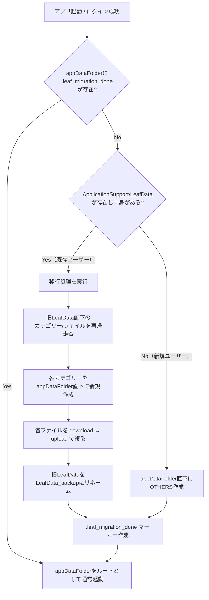

# Leaf データ保存先 appDataFolder 移行 仕様書

作成日: 2026-07-05
対象バージョン: 未定（次期リリース）

## 1. 目的

シートデータの保存先を、現在のユーザー可視領域
`マイドライブ/ApplicationSupport/LeafData/…` から、Google Drive のアプリ専用・
非表示領域 **`appDataFolder`** へ移行する。

これにより、ユーザーのマイドライブを汚さず、アプリ専用データとして隠蔽された
状態で管理できるようにする。

## 2. 決定事項（作業者確認済み）

| 項目 | 決定内容 |
|---|---|
| 旧フォルダの扱い | 移行後、`ApplicationSupport/LeafData` を **`LeafData_backup` にリネームして残す**（削除しない） |
| appDataFolder内の構成 | 入れ物フォルダを作らず、**カテゴリーを `appDataFolder` 直下に直接配置** |
| 既存ユーザーの再認証 | **許容する**（`drive.appdata` スコープ追加に伴う一度の再同意を求める） |

## 3. 現状の構成（移行前）

```
マイドライブ/
  └ ApplicationSupport/
      └ LeafData/            ← leafDataId（アプリ全体の保存ルート）
          ├ OTHERS/          ← デフォルトカテゴリー
          │   └ <ファイル群>
          └ <カテゴリー>/
              └ <ファイル群>
```

- 生成: `assets/js/drive.js` の `ensure_directory_structure()`
- OAuth スコープ: `openid email https://www.googleapis.com/auth/drive.file`
  （`assets/js/auth.js`）
- `leafDataId` を `src/app.rs` 全体で保存ルートとして使用
- Web版・Tauri版とも同一の `drive.js` / `auth.js` を共有

## 4. 移行後の構成

```
appDataFolder/              ← 特殊エイリアス（アプリ専用・非表示領域）
  ├ .leaf_migration_done    ← 移行完了マーカー（空ファイル）
  ├ OTHERS/                 ← デフォルトカテゴリー
  │   └ <ファイル群>
  └ <カテゴリー>/
      └ <ファイル群>

マイドライブ/
  └ ApplicationSupport/
      └ LeafData_backup/    ← 旧データ（リネームして保全）
```

- `leafDataId` は特殊エイリアス文字列 `'appDataFolder'` を指す。
- カテゴリー = `appDataFolder` 直下のサブフォルダ。

## 5. 技術的制約（重要）

1. **専用スコープが必須**
   `appDataFolder` へのアクセスには
   `https://www.googleapis.com/auth/drive.appdata` が必要。
   移行処理では旧領域(`drive.file`)の読み取りと新領域(`drive.appdata`)への
   書き込みを同時に行うため、**両スコープを併用**する。
   スコープ文字列:
   `openid email https://www.googleapis.com/auth/drive.file https://www.googleapis.com/auth/drive.appdata`

2. **領域(space)をまたぐ move / copy は不可**
   通常領域と `appDataFolder` 領域の間ではファイルの移動・コピーが
   API で禁止されている。移行は
   **download（旧ファイル内容取得）→ upload（appDataFolderへ新規作成）**
   で行う。

3. **appDataFolder のクエリには `spaces=appDataFolder` が必要**
   一覧・検索時は `spaces=appDataFolder` パラメータを付与する。
   作成時は `parents:['appDataFolder']` を指定（spaces不要）。

4. **Google Cloud Console 側の対応**
   OAuth 同意画面に `drive.appdata` スコープを追加する必要がある
   （機微スコープ。公開アプリでは審査が絡む可能性あり）。

## 6. 起動時フロー



### 中断対策
- 移行完了マーカー `.leaf_migration_done` は**全処理の最後**に作成する。
- マーカーが無い限り、次回起動時に移行を（冪等に）再試行できる。
- 再試行時、既に appDataFolder 側へ作成済みのカテゴリー/ファイルは
  `find_or_create_folder` / `find_file_by_name` により重複作成を回避する。

## 7. 改修対象ファイル（想定）

| ファイル | 変更内容 |
|---|---|
| `assets/js/auth.js` | スコープに `drive.appdata` を追加 |
| `assets/js/drive.js` | `spaces=appDataFolder` 対応の一覧/検索/作成関数追加、移行関数 `migrate_to_appdata()` 追加、`ensure_directory_structure()` を appDataFolder ベースへ変更 |
| `src/drive_interop.rs` | 移行関数の wasm-bindgen extern 追加 |
| `src/app.rs` | 起動時の移行判定・呼び出し追加、`leafDataId` 取得箇所の調整 |
| `src/i18n.rs` | 移行中メッセージ、ウェルカム文言の保存先表記更新（8言語） |
| Google Cloud Console | OAuth 同意画面へスコープ追加（作業者手動対応） |

## 8. 影響・注意点

- 既存ユーザーは次回ログイン時に **一度だけ再同意** が必要。
- 移行中はファイル数に応じて download/upload が発生するため、
  進捗表示（`synchronizing` 等）を出す。
- `appDataFolder` のデータは Drive UI から参照できない（「アプリの管理」から
  削除は可能）。ウェルカム文の「マイドライブ/ApplicationSupport/LeafData に
  作成される」旨の記述を更新する必要がある。
- 移行後もデータ量は利用者の Drive 容量を消費する（appDataFolder も課金対象）。

## 9. 未確定・要検討事項

- 移行失敗時のユーザー向けエラー表示方針。
- 大量ファイル時の移行時間・レート制限対策（バッチ/バックオフ）。
- ウェルカム文言（8言語）の新しい表現。
