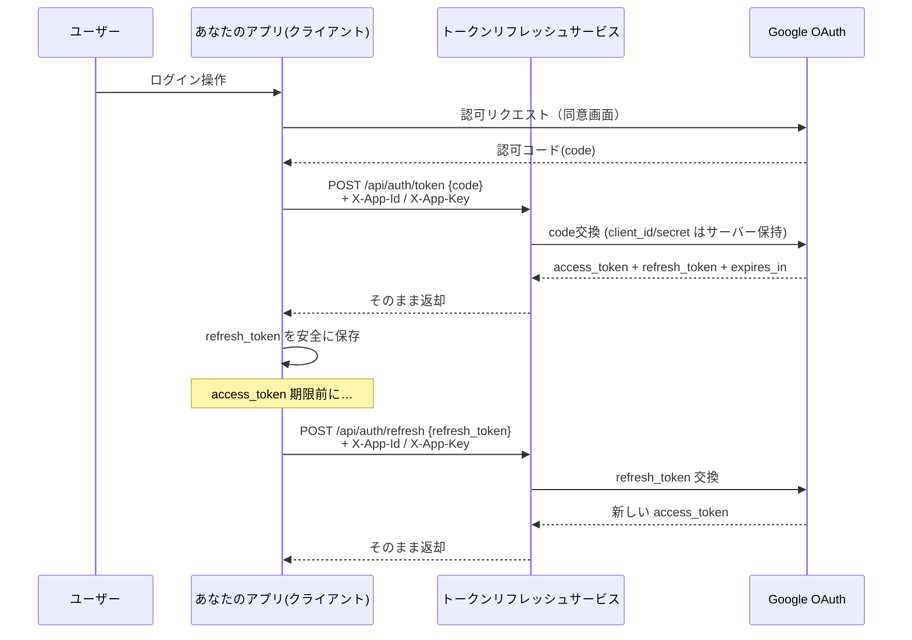

# トークンサイレントリフレッシュサービス 統合ガイド（クライアント実装者向け）

このドキュメントは、あなたのアプリから「トークンサイレントリフレッシュサービス」
（Google OAuth の認可コード交換 / アクセストークンのサイレント更新を代行するプロキシ）を
利用するための実装手順をまとめたものです。実装担当がこの1枚を読めば統合できることを目的としています。

---

## 1. サービス概要

- Google の `client_secret` を**サーバー側だけで保持**し、クライアントには埋め込ませないための認証プロキシです。
- 提供する機能は2つだけです。
  1. 認可コード → トークン交換（`refresh_token` / `access_token` の取得）
  2. `refresh_token` によるアクセストークンのサイレント更新
- **マルチテナント対応**：`app_id` と共有キー（`shared_key`）でアプリを識別し、アプリごとに別々の
  Google OAuth クライアント（別プロジェクト）のクレデンシャルを使い分けます。

### エンドポイント

| メソッド | パス | 用途 |
|---|---|---|
| POST | `https://auth.digitarhythm.net/api/auth/token` | 認可コードをトークンに交換 |
| POST | `https://auth.digitarhythm.net/api/auth/refresh` | refresh_token でアクセストークンを更新 |

> ローカル開発時は `http://localhost:3000/...`（バックエンド直叩き）も利用できます。

---

## 2. 前提：事前登録（サービス運用者側の作業）

このサービスは**登録済みアプリのみ**が利用できます。利用開始前に、サービス運用者が
サーバーの `apps.json` に次のエントリを追加します。**クライアント実装者は運用者へ以下を依頼してください。**

```jsonc
// apps.json（サーバー上・バージョン管理外）
{
  "myapp": {                                         // ← あなたのアプリの app_id
    "client_id":     "xxxx.apps.googleusercontent.com",
    "client_secret": "GOCSPX-xxxx",
    "shared_key":    "32byte以上のランダムな長い文字列"   // ← あなたのアプリの共有キー
  }
}
```

登録後、サーバーのバックエンドサービスを再起動すれば有効になります。

### あなた（クライアント側）が用意するもの

1. **専用の Google Cloud プロジェクト**（他アプリと共用しない）
2. そのプロジェクトの **OAuth 2.0 クライアント ID / シークレット**
3. **一意な `app_id`**（例: `myapp`）
4. **共有キー `shared_key`**（推測不能なランダム値。例: `openssl rand -hex 32`）

`client_id` / `client_secret` / `shared_key` を運用者へ渡し、`apps.json` に登録してもらいます。
**`client_secret` はクライアントアプリには絶対に埋め込まないでください**（サーバーだけが保持します）。

---

## 3. Google Cloud 側の設定

1. [Google Cloud Console](https://console.cloud.google.com/) で**新規プロジェクトを作成**。
2. 「APIとサービス」→「OAuth 同意画面」を設定（アプリ名・スコープ・テストユーザー等）。
3. 使用する Google API を有効化（例: Drive を使うなら Google Drive API）。
4. 「認証情報」→「OAuth 2.0 クライアント ID」を作成。
   - Web アプリの場合：**承認済みの JavaScript 生成元**にアプリのオリジンを追加。
   - **リダイレクト URI** はフロー次第（下記4章参照）。GIS ポップアップ方式なら不要。
5. 必要な**スコープ**を決める（最小権限で。例: `openid email https://www.googleapis.com/auth/drive.file`）。

> **refresh_token を得る条件**：初回同意時、またはオフラインアクセスを要求した認可フローで
> のみ Google は `refresh_token` を返します（詳細は5章）。

---

## 4. 認証フローの全体像



---

## 5. HTTP 仕様（厳密）

### 共通ヘッダ（必須）

| ヘッダ | 値 | 必須 |
|---|---|---|
| `Content-Type` | `application/json` | ○ |
| `X-App-Id` | 登録した `app_id`（例: `myapp`） | ○（※） |
| `X-App-Key` | 登録した `shared_key` | ○（※） |

> ※ `X-App-Id` を**付けない**リクエストは、サーバー既定アプリ用の「レガシー互換モード」で
> 処理されます。**あなたのアプリは必ず `X-App-Id` と `X-App-Key` を付与**してください。

### 5.1 `POST /api/auth/token`（認可コード交換）

**リクエストボディ**
```json
{
  "code": "4/0Axxxxxxxx",
  "redirect_uri": "https://yourapp.example.com/callback"
}
```
- `code`：Google から受け取った認可コード（必須）。
- `redirect_uri`：認可時に使ったリダイレクト URI。**省略時はサーバー既定の `postmessage`**
  （Google Identity Services のポップアップ方式用）になります。
  リダイレクト方式や native 方式では、**認可時と同一の `redirect_uri` を必ず指定**してください
  （不一致だと Google 側で `redirect_uri_mismatch` になります）。

**レスポンス**（Google のトークンレスポンスをそのまま返却）
```json
{
  "access_token": "ya29....",
  "expires_in": 3599,
  "refresh_token": "1//0g....",
  "scope": "https://www.googleapis.com/auth/drive.file openid ...",
  "token_type": "Bearer",
  "id_token": "eyJ..."
}
```
- **`refresh_token` は初回同意時のみ返ることが多い**です。確実に得たい場合は認可時に
  `access_type=offline` かつ `prompt=consent` を指定してください（GIS の code フローは既定でオフライン対応）。
- 得た `refresh_token` は**次回以降のサイレント更新のために保存**します（web は localStorage、
  native は OS のセキュアストレージ等）。

### 5.2 `POST /api/auth/refresh`（サイレント更新）

**リクエストボディ**
```json
{ "refresh_token": "1//0g...." }
```

**レスポンス**（Google のトークンレスポンスをそのまま返却）
```json
{
  "access_token": "ya29....",
  "expires_in": 3599,
  "scope": "...",
  "token_type": "Bearer",
  "id_token": "eyJ..."
}
```
- refresh のレスポンスには通常 `refresh_token` は含まれません（既存のものを使い続けます）。

### 5.3 エラー

| ステータス | 意味 | 対処 |
|---|---|---|
| 400 | `code` / `refresh_token` が欠落 | リクエストボディを確認 |
| 401 | `X-App-Key` が欠落／不一致 | 共有キーを確認 |
| 404 | `X-App-Id` が未登録 | 運用者に `apps.json` 登録を依頼 |
| 500 | サーバー設定不備、または Google 側エラー | `details` を確認。`invalid_grant` の場合は refresh_token 失効 → 再ログインが必要 |

500 の `invalid_grant` 例（refresh_token 失効・取り消し・期限切れ）：
```json
{ "error": "Refresh failed", "details": { "error": "invalid_grant", "error_description": "Bad Request" } }
```
この場合は**サイレント更新を諦めて再ログイン（再認可）フロー**へフォールバックしてください。

---

## 6. 実装例

### 6.1 トークン交換（認可コード → トークン）

```js
const AUTH_BASE = 'https://auth.digitarhythm.net';
const APP_ID  = 'myapp';
const APP_KEY = '（登録した共有キー）';

async function exchangeCodeForToken(code, redirectUri /* 省略可 */) {
  const res = await fetch(`${AUTH_BASE}/api/auth/token`, {
    method: 'POST',
    headers: {
      'Content-Type': 'application/json',
      'X-App-Id': APP_ID,
      'X-App-Key': APP_KEY,
    },
    body: JSON.stringify(redirectUri ? { code, redirect_uri: redirectUri } : { code }),
  });
  if (!res.ok) throw new Error(`Token exchange failed: ${res.status}`);
  const data = await res.json(); // { access_token, refresh_token, expires_in, ... }
  if (data.refresh_token) localStorage.setItem('app_refresh_token', data.refresh_token);
  localStorage.setItem('app_access_token', data.access_token);
  localStorage.setItem('app_token_expiry', String(Date.now() + data.expires_in * 1000));
  return data.access_token;
}
```

### 6.2 サイレント更新

```js
async function silentRefresh() {
  const refreshToken = localStorage.getItem('app_refresh_token');
  if (!refreshToken) return null; // → 再ログインへ

  const res = await fetch(`${AUTH_BASE}/api/auth/refresh`, {
    method: 'POST',
    headers: {
      'Content-Type': 'application/json',
      'X-App-Id': APP_ID,
      'X-App-Key': APP_KEY,
    },
    body: JSON.stringify({ refresh_token: refreshToken }),
  });

  if (!res.ok) {
    // 500 invalid_grant 等 → refresh_token 失効。再ログインフローへ。
    return null;
  }
  const data = await res.json();
  localStorage.setItem('app_access_token', data.access_token);
  localStorage.setItem('app_token_expiry', String(Date.now() + data.expires_in * 1000));
  return data.access_token;
}
```

### 6.3 期限前の自動更新（推奨）

```js
// 定期チェックで、期限の10分前を切ったら先回りして更新
setInterval(async () => {
  if (!navigator.onLine) return;
  const expiry = parseInt(localStorage.getItem('app_token_expiry') || '0', 10);
  if (expiry && expiry - Date.now() < 10 * 60 * 1000) {
    try { await silentRefresh(); } catch (_) { /* ネットワーク断は次回リトライ */ }
  }
}, 60 * 1000);
```

### 6.4 Web の認可コード取得（Google Identity Services / ポップアップ方式）

```html
<script src="https://accounts.google.com/gsi/client" async defer></script>
```
```js
const codeClient = google.accounts.oauth2.initCodeClient({
  client_id: 'xxxx.apps.googleusercontent.com', // ← あなたのGoogleクライアントID（公開情報でOK）
  scope: 'openid email https://www.googleapis.com/auth/drive.file',
  ux_mode: 'popup',
  callback: async (resp) => {
    if (resp.error) { /* エラー処理 */ return; }
    // ポップアップ方式のときサーバーは redirect_uri='postmessage' で交換するため、
    // exchangeCodeForToken では redirect_uri を省略してよい。
    await exchangeCodeForToken(resp.code);
  },
});
// ログインボタン押下時:
codeClient.requestCode();
```

> リダイレクト方式や native（デスクトップ）方式を使う場合は、
> `exchangeCodeForToken(code, redirectUri)` に**認可時と同一の `redirect_uri`** を必ず渡してください。

---

## 7. 重要な注意点

1. **`client_secret` はクライアントに埋め込まない**。サーバー（このプロキシ）だけが保持します。
2. **各アプリは自分専用の Google プロジェクト/OAuth クライアントを使う**。
   refresh_token は「発行時の client_id/secret ペア」に紐付くため、他アプリのクレデンシャルでは更新できません。
3. **`app_id` と `shared_key` は必ずペアで送る**。`X-App-Id` を省くとサーバー既定アプリ用のレガシー互換扱いになり失敗します。
4. **`shared_key` はクライアントに置くと露出し得る**点に留意。web フロントエンドに直書きすると
   ブラウザから見えます。より厳格にするなら、共有キー検証を自前の軽量バックエンド経由にする等を検討してください。
5. **`invalid_grant` は再ログイン合図**。サイレント更新が 500/invalid_grant を返したら、
   保存済み refresh_token を破棄して再認可フローへ。
6. **スコープは最小限**に。使う API に必要な範囲だけを要求してください。

---

## 8. 動作確認（curl）

```bash
# 未登録 app_id は 404（サービス到達確認）
curl -s -o /dev/null -w "%{http_code}\n" -X POST https://auth.digitarhythm.net/api/auth/refresh \
  -H "Content-Type: application/json" -H "X-App-Id: nope" -d '{"refresh_token":"x"}'   # → 404

# 登録済み app_id + 正しいキー + ダミー refresh_token は 500 invalid_grant（＝Googleへ到達）
curl -s -w "\n%{http_code}\n" -X POST https://auth.digitarhythm.net/api/auth/refresh \
  -H "Content-Type: application/json" -H "X-App-Id: myapp" -H "X-App-Key: <shared_key>" \
  -d '{"refresh_token":"1//dummy"}'   # → 500 invalid_grant
```
