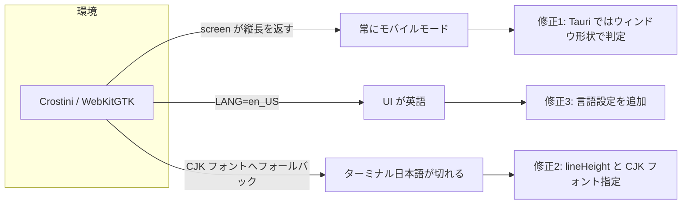

# Chromebook（Crostini）版で顕在化した 3 件の不具合修正仕様

ARM Chromebook の Linux 開発環境（Crostini / WebKitGTK）で Leaf を起動した際に確認された
以下 3 件を修正する。いずれも Chromebook 固有ではなく、環境依存で他プラットフォームでも
起こり得る問題である。

| # | 症状 | 原因 | 影響範囲 |
|---|---|---|---|
| 1 | 横長ディスプレイなのに常にモバイルモード | `window.screen` の誤報告 | Tauri デスクトップ版全般 |
| 2 | ターミナルの日本語が縦に切れる | xterm.js の `lineHeight` 未指定 | Linux/Windows 版（CJK 表示時） |
| 3 | UI が英語になる | `navigator.language` が OS ロケール依存 | ロケール未設定の環境全般 |



---

## 修正 1: モバイルモードの判定

### 現状（`src/app.rs:988-1021`）

```rust
let device_is_portrait = scr_w < scr_h;
let window_is_portrait = win_w < win_h;
let is_narrow_window   = win_w <= (scr_w / 2.0);
let is_portrait = device_is_portrait || (window_is_portrait && is_narrow_window);
```

ユーザーエージェント判定は行っておらず、画面・ウィンドウの縦横比のみで判定している。

### 問題

WebKitGTK は `window.screen.width` / `height` を Wayland/X11 コンポジタ
（Crostini では sommelier）から取得するため、実際のディスプレイが横長でも
縦長の値を返すことがある。この場合 `device_is_portrait` が常に true となり、
ウィンドウをどう変形してもモバイルモードから抜けられない。

### 修正

Tauri デスクトップ版では `screen` を一切参照せず、**ウィンドウ形状のみ**で判定する。
デスクトップでモバイルレイアウトが必要になるのは「ウィンドウを細くした時」だけであり、
物理ディスプレイの向きを見る必要がない。

```rust
const MOBILE_MAX_WIDTH: f64 = 700.0;

let is_portrait = if crate::js_interop::is_tauri() {
    win_w < win_h && win_w <= MOBILE_MAX_WIDTH
} else {
    device_is_portrait || (window_is_portrait && is_narrow_window)
};
```

Web 版（スマートフォン）の判定は従来どおり変更しない。

---

## 修正 2: ターミナルの日本語が縦に切れる

### 現状（`assets/js/editor_interop.js:1095-1097`）

```js
const terminal = new window.Terminal({
    cursorBlink: true, fontSize: 14,
    fontFamily: "'JetBrains Mono', 'Menlo', 'Monaco', 'Courier New', monospace",
```

### 問題

1. `lineHeight` 未指定（xterm.js の既定は `1.0`）。xterm.js は行の高さを
   **フォントリスト先頭の欧文フォントのメトリクス**から算出する。日本語はそのフォントに
   字形が無いためシステムの CJK フォントへフォールバックするが、CJK フォントは
   ascent/descent が大きく、算出済みの行高に収まらず上下が切れる。
2. フォントリストに CJK フォントが含まれておらず、フォールバック先が環境任せになる。
   プロポーショナルフォントが選ばれると桁揃えも崩れる。

### 修正

```js
const terminal = new window.Terminal({
    cursorBlink: true, fontSize: 14,
    // CJK フォントは欧文フォントより ascent/descent が大きく、既定の lineHeight(1.0)
    // では行高に収まらず上下が切れるため余裕を持たせる
    lineHeight: 1.2,
    fontFamily: "'JetBrains Mono', 'Menlo', 'Monaco', 'Noto Sans Mono CJK JP', 'Noto Sans CJK JP', 'Courier New', monospace",
```

副作用として行間がわずかに広がり、同じ高さで表示できる行数が約 17% 減る。

### Service Worker キャッシュ

`editor_interop.js` は `assets/js/sw.js` の `PRECACHE_ASSETS` に含まれ、cache-first で
配信される。変更を反映させるため `CACHE_NAME` を `leaf-cache-v20` → `leaf-cache-v21` に更新する。

---

## 修正 3: 表示言語の設定を追加

### 現状（`src/i18n.rs:17-32`）

```rust
let lang = window().and_then(|w| w.navigator().language()).unwrap_or("en");
if lang.starts_with("ja") { Language::Ja } else { ... } else { Language::En }
```

### 問題

WebKitGTK の `navigator.language` はプロセスのロケール（`LANG`）から決まる。
Crostini のコンテナは既定で `en_US.UTF-8` のため常に英語になる。
ChromeOS 本体の言語設定は Linux コンテナへ引き継がれない。
アプリ側に言語を指定する手段が無いため、ユーザーは回避できない。

### 修正

設定ダイアログに言語選択を追加し、`localStorage` に保存する。
保存された言語があれば `navigator.language` より優先する。

```rust
const LANGUAGE_KEY: &str = "leaf_language";

/// 保存値と navigator.language から表示言語を決定する（副作用なし・テスト対象）
pub fn resolve(stored: Option<&str>, navigator_lang: &str) -> Language {
    if let Some(code) = stored {
        if let Some(l) = Language::from_code(code) { return l; }
    }
    Language::from_prefix(&navigator_lang.to_lowercase())
}
```

`Language::detect()` は `resolve()` に実際の値を渡すだけの薄いラッパーとする。
`detect()` はアプリ全体で 13 箇所からレンダリング時に呼ばれているため、
この 1 箇所の変更で全コンポーネントに反映される。

### 言語の反映方法

Yew の関数コンポーネントは props が変化しない子を再レンダリングしないため、
言語を変えても即座に全画面へ反映されない。各コンポーネントに `lang` props を
追加する改修は影響範囲が大きいため、**言語変更時は保存後にページを再読み込みする**。

再読み込み前に `on_save_cb.emit((false, None))` で現在のシートを保存し、
300ms 待ってから `location.reload()` を呼ぶ（既存の「保存してから破壊的操作」パターンに合わせる）。

### UI

設定ダイアログの「エディタテーマ」の上に言語セクションを追加する。
選択肢は既存のテーマ選択と同じボタングリッドとする。

| 表示 | 保存値 |
|---|---|
| Auto（システム設定に従う） | 未保存（キー削除） |
| English | `en` |
| 日本語 | `ja` |
| 中文 | `zh` |
| 한국어 | `ko` |
| Español | `es` |
| Deutsch | `de` |
| Français | `fr` |
| Italiano | `it` |
| Nederlands | `nl` |

言語名はそれぞれの言語で表記する（翻訳不要）。
セクション見出しと Auto のラベル、再読み込みの注意書きは i18n 対応する
（新規キー: `language` / `language_auto` / `language_reload_note`）。

---

## テスト

本リポジトリにはテストの実行基盤が無い（`#[test]` / `tests/` ディレクトリとも存在しない）。
今回の修正のうち純粋関数として切り出せる `Language::resolve` / `from_code` / `from_prefix`
について `src/i18n.rs` に `#[cfg(test)]` の単体テストを追加する。

| # | 入力 | 期待 |
|---|---|---|
| 1 | `resolve(None, "ja-JP")` | `Ja` |
| 2 | `resolve(None, "en-US")` | `En` |
| 3 | `resolve(Some("ja"), "en-US")` | `Ja`（保存値が優先） |
| 4 | `resolve(Some("en"), "ja-JP")` | `En`（保存値が優先） |
| 5 | `resolve(Some("xx"), "ja-JP")` | `Ja`（不正な保存値は無視） |
| 6 | `resolve(None, "fr")` | `Fr` |
| 7 | 全 `Language` で `from_code(code())` | 元の値に戻る |

### 手動確認（Chromebook 実機）

| # | 確認内容 | 期待 |
|---|---|---|
| 1 | 横長ウィンドウで起動 | モバイルモードにならない |
| 2 | ウィンドウを幅 700px 未満かつ縦長に変形 | モバイルモードになる |
| 3 | ターミナルで `ls` 等の日本語を含む出力 | 文字の上下が切れない |
| 4 | 設定 → 言語 → 日本語 | 再読み込み後に UI が日本語になる |
| 5 | 設定 → 言語 → Auto | `navigator.language` に従う（Crostini では英語） |
| 6 | macOS / Windows で回帰確認 | モバイルモードにならない・言語が従来どおり |

---

## 影響範囲

| ファイル | 内容 |
|---|---|
| `src/app.rs` | モバイル判定の分岐、SettingsDialog への props 追加 |
| `src/i18n.rs` | 言語コード変換・保存値優先の判定・新規 i18n キー・単体テスト |
| `src/components/settings_dialog.rs` | 言語選択セクション追加 |
| `assets/js/editor_interop.js` | xterm.js の `lineHeight` / `fontFamily` |
| `assets/js/sw.js` | `CACHE_NAME` の更新 |

保存データ構造（IndexedDB / Sheet）の変更は無い。
