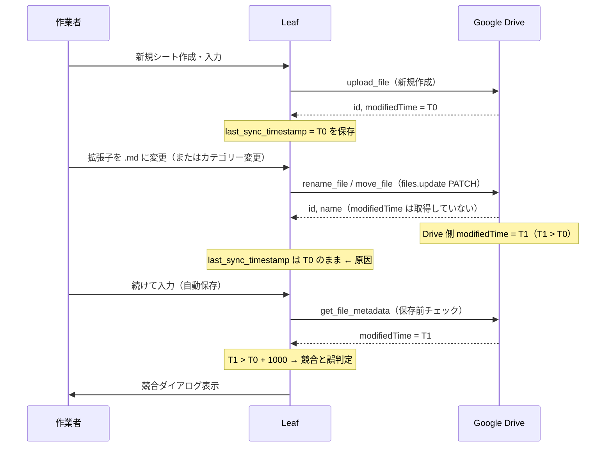

# 新規シートで競合ダイアログが出る問題の調査報告

- 対象アプリ: Leaf（v0.26.0 時点のコードベース）
- 調査日: 2026-07-27
- 症状: 新規シートを作った時に、稀に「編集内容を保存するか / Google Drive のファイルを読み込むか」を
  問う競合ダイアログが表示される

---

## 1. 結論（根本原因）

**Drive 上のファイル名変更（rename）やフォルダ移動（move）を行った後、シートの
`last_sync_timestamp` を更新していない**ことが原因。

Google Drive の `files.update`（PATCH）はメタデータ変更でも `modifiedTime` を更新するため、
rename / move の直後は「Drive の modifiedTime」＞「Leaf が保持する last_sync_timestamp」となる。
この状態で次の保存が走ると、保存前チェックが**他デバイスによる更新と誤検知**して競合ダイアログを出す。

該当する判定（`src/app.rs:1471`）:

```rust
if drive_time > sync_ts + 1000 {
    // Driveの方が新しい → コンフリクトダイアログを表示して保存中断
```

---

## 2. 発生シーケンス



### なぜ「新規シート作成時」に偏るのか

新規シートは作成直後にカテゴリーや拡張子を選ぶ操作をすることが多く、
**初回保存で `last_sync_timestamp` が入った直後に rename / move が走る**ため。
既存シートの編集では rename / move が発生しないので再現しない＝「偶に」出る。

---

## 3. 該当箇所（すべて `last_sync_timestamp` 未更新）

| # | 箇所 | 操作 | 内容 |
|---|---|---|---|
| 1 | `src/app.rs:2299` | 拡張子変更 | `rename_file()` 成功後に `title` のみ更新 |
| 2 | `src/app.rs:2246` | カテゴリー変更 | `move_file()` 成功後に `category` のみ更新 |
| 3 | `src/app.rs:1774` | カテゴリー削除時のファイル退避 | 配下ファイルを OTHERS へ `move_file()` |
| 4 | `src/components/file_open_dialog.rs:1048` → `src/app.rs:2071`（`on_move_file_cb`） | ファイル一覧からの移動 | `move_file()` 後に `category` のみ更新 |
| 5 | `assets/js/drive.js`（`dedupe_appdata_categories()` 内 `move_file`） | 重複カテゴリーの統合 | 保存のたびに呼ばれる `ensure_directory_structure()` の中で実行される |

補足:

- `move_file()` は `fields=id,parents` しか要求しておらず、そもそも `modifiedTime` を受け取れない
  （`assets/js/drive.js:440`）。
- `rename_file()` はレスポンス全体を返すが、呼び出し側で `modifiedTime` を読んでいない
  （`assets/js/drive.js:457`, `src/app.rs:2299`）。
- 一方、通常の保存（`upload_file`）は保存後に `get_file_metadata()` で権威的な値を取り直して
  `last_sync_timestamp` に反映しており（`src/app.rs:1505-1519`）、こちらは正しく処理されている。

---

## 4. 副次的なリスク（同じズレによる別経路）

`trigger_conflict_check()`（ウィンドウ復帰・可視化時などに実行）では、同じ時刻ズレが
**ダイアログを出さずに Drive の内容で自動上書き**する分岐に入る（`src/app.rs:569-604`）。

```rust
if drive_time > last_sync + 1000 {
    // Googleドライブの方が新しい → ダイアログを出さずにDriveの内容で自動更新
```

rename / move の直後にウィンドウを切り替えると、ローカルの未保存編集が Drive の内容で
置き換えられる可能性がある。競合ダイアログよりこちらの方が影響が大きい。

---

## 5. 修正案（未実装・指示待ち）

| 案 | 内容 | 備考 |
|---|---|---|
| A | `rename_file` / `move_file` の `fields` に `modifiedTime` を追加し、成功時に該当シートの `last_sync_timestamp` を更新する | 本質的な修正。呼び出し 4 箇所すべてに適用 |
| B | `dedupe_appdata_categories()` の move 後、対象ファイルの `last_sync_timestamp` を更新（または dedupe 実行を検知して次回保存時に再取得） | JS 側はシート情報を持たないため、move したファイル ID を返して Rust 側で反映する形が素直 |
| C | 保存前チェックで「Drive が新しい」場合でも、**Drive の内容とローカル内容が同一**なら競合としない（サイズ／内容比較でメタデータ変更のみを除外） | 保険。A/B を入れても取りこぼしを防げる |
| D | `trigger_conflict_check()` の自動上書き分岐にも C と同じガードを入れる | 未保存編集の消失防止 |

推奨は **A + C**（+ 余力があれば B・D）。A で根本を断ち、C で将来同種の実装漏れが起きても
競合ダイアログが誤発火しないようにする。

---

## 6. 再現手順（想定）

1. 新規シートを作成し、カテゴリーを選ぶ（または何か入力して自動保存させる）
2. 保存が完了したのを確認（ガターの色が通常に戻る）
3. フッターの拡張子を `.txt` → `.md` などに変更する（Drive 上で rename が走る）
4. さらに文字を入力して自動保存を待つ
5. → 競合ダイアログが表示される

※ 手順 3 の代わりにカテゴリー変更でも同様。
