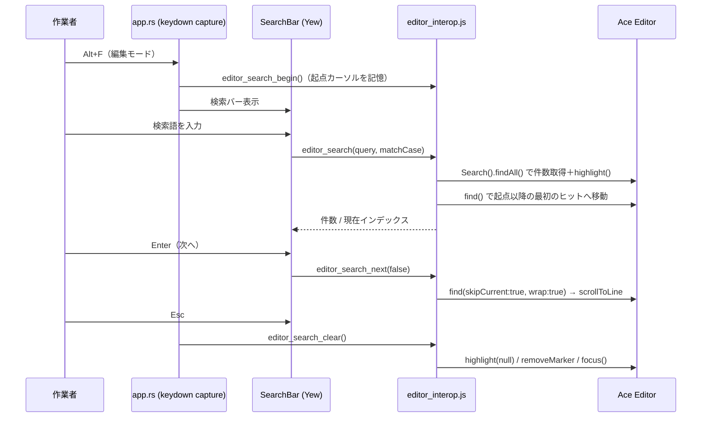

# エディタ検索の独自実装への置き換え仕様書

- 対象アプリ: Leaf（Web版 / Tauri版共通）
- 起票日: 2026-07-27
- 前提バージョン: v0.25.0（プレビュー内検索バーを実装済み）
- 関連: [PREVIEW_SEARCH_AND_SHORTCUTS_SPEC.md](./PREVIEW_SEARCH_AND_SHORTCUTS_SPEC.md)

---

## 1. 目的

v0.25.0 で追加したプレビュー内検索バーと同じ UI・操作感を、Ace エディタでの検索にも適用する。
Ace 標準の検索ボックス（`ext-searchbox`）は使用しない。**置換機能は対象外**（Vim の `:s` で代替）。

---

## 2. 現状

| 項目 | 現状 |
|---|---|
| `Alt+F`（編集時） | `exec_editor_command("find")` → Ace 標準の検索ボックスを表示 |
| `Cmd+F` / `Ctrl+F` | Ace 組み込みの `find` コマンドで同じ検索ボックスを表示 |
| 検索ボックスの見た目 | `index.html` 内の CSS（`.ace_search` 他 約100行）で独自装飾 |
| Vim モードの `/` `?` `n` `N` | Ace の Vim キーバインド実装（独立、今回の対象外） |

---

## 3. 実装方式

### 3.1 Ace 側の検索 API（すべて公開 API）

| 用途 | API |
|---|---|
| 全ヒットの列挙（件数・移動・ハイライト） | `ace.require("ace/search").Search` を生成し `.set({needle, caseSensitive, wrap:true, regExp:false}).findAll(session)` → `Range[]` |
| 全ヒットのハイライト | `session.addMarker(range, "leaf-search-hit", "text")`（上限500件） |
| 現在ヒットの強調 | `session.addMarker(range, "leaf-search-current", "text")` / `removeMarker` |
| 現在ヒットの選択 | `editor.selection.setSelectionRange(range)`（閉じた時にカーソルが残る） |
| 画面内へスクロール | `editor.scrollToLine(row, true, false)` |
| 再描画 | `editor.renderer.updateFull(true)` |

実装上の注意（動作確認で判明）:

- **`session.highlight(regexp)` は使えない**。Ace は選択が変わるたびに約50ms後に
  `session.highlight()` を呼び直す（選択語ハイライト機能）ため、こちらで設定した
  正規表現が消される。全ヒットも独自マーカーで描画する。
- 検索中は `editor.setOption("highlightSelectedWord", false)` にして、Ace の選択語
  ハイライトと二重に色が付かないようにする（終了時に元へ戻す）。
- マーカーの削除は `updateBackMarkers()` だけでは古い描画が残るため、
  `renderer.updateFull(true)` で再描画する。

- 対象エディタは**フォーカス中のインスタンス**（メインエディタ / 分割エディタ）を自動判定する。
- 検索の起点は**バーを開いた時点のカーソル位置**を記憶し、入力のたびにそこから検索し直す
  （インクリメンタルサーチでカーソルが流れていかないようにする）。

### 3.2 UI（プレビュー検索と共通）

既存の `PreviewSearchBar` を**共通コンポーネント `SearchBar` に一般化**し、検索の実処理を
「プレビュー用」「エディタ用」で切り替える。見た目・キー操作は完全に同じ。

| 操作 | 動作 |
|---|---|
| `Alt+F` | 検索バーを開く／閉じる（トグル）。**Vim モード／非 Vim モードを問わず同じ動作**（`Alt+F` は Ace のキーバインドではなく `app.rs` の window keydown（capture）で処理するため、キーボードハンドラの種類に影響されない） |
| 入力 | 150ms デバウンスのインクリメンタルサーチ、全ヒットをハイライト |
| `Enter` / `Shift+Enter` | 次／前のヒットへ（末尾↔先頭を循環） |
| `Aa` | 大文字小文字の区別を切替（設定は保持） |
| `Esc` | バーを閉じ、ハイライトを解除し、**カーソルは現在ヒット位置に残してエディタへフォーカスを戻す** |
| ヒット0件 | 「見つかりません」表示＋入力欄を警告色、前後ボタンは無効 |

- 表示位置はエディタペインの右上（プレビュー時と同じ位置）。
- 分割表示中は、対象エディタ側のペイン右上に表示する。

### 3.3 Ace 標準検索ボックスの無効化（Cmd / Ctrl は使わない方針）

Leaf は Cmd / Ctrl のショートカットを使わない方針のため、**新しい検索バーにも
`Cmd+F` / `Ctrl+F` は割り当てない**。割り当てるのは `Alt+F` のみ。

- `editor.commands.removeCommand("find")` / `removeCommand("replace")` /
  `removeCommand("findnext")` / `removeCommand("findprevious")` を実行し、
  `Cmd+F` / `Ctrl+F` / `Cmd+Option+F` / `Cmd+G` から Ace の検索ダイアログが開かないようにする。
- これにより **Vim モードの `Ctrl+F`（1画面下スクロール）が最優先で効く**。
  Ace のキー処理はキーボードハンドラ（Vim）→ コマンド既定バインドの順で走るため、
  find コマンドを削除すれば Vim 側の割り当てだけが残る。
- アプリ側（`app.rs` の window keydown）でも `Cmd+F` / `Ctrl+F` は横取りしない
  （横取りすると Vim の `Ctrl+F` まで潰れるため）。
- `index.html` の `.ace_search*` 用 CSS（約100行）は不要になるため削除する。
- Vim モードの `/` `?` `n` `N` `:s` は Ace の Vim 実装のまま**変更しない**。

> 注: Web 版では、非 Vim モードで `Cmd+F` / `Ctrl+F` を押すとブラウザ標準の検索バーが開く
> （Ace が握らなくなるため）。Tauri 版では何も起きない。ブラウザ検索も抑止したい場合は
> 別途アプリ側で `preventDefault` する必要があるが、Vim の `Ctrl+F` を殺さないための
> モード判定が必要になるため、既定では抑止しない。

### 3.4 処理フロー

### 3.5 変更・追加ファイル

| ファイル | 内容 |
|---|---|
| `assets/js/editor_interop.js` | `editor_search_begin` / `editor_search` / `editor_search_goto` / `editor_search_clear` を追加、`findInLeaf` コマンドと Ace 標準 `find`・`replace` の無効化 |
| `src/js_interop.rs` | 上記のバインディング追加 |
| `src/components/preview_search.rs` → `src/components/search_bar.rs` | プレビュー用／エディタ用を切り替える共通コンポーネントに一般化 |
| `src/components/mod.rs` | モジュール名変更 |
| `src/app.rs` | 編集モードの `Alt+F` を新バーへ、表示状態の管理、`Esc` の優先順位、エディタペインへの描画 |
| `assets/css/input.css` | `.ace_selected-word`（全ヒット=黄）と `.leaf-search-current`（現在ヒット=橙）のスタイル |
| `index.html` | 不要になる `.ace_search*` CSS の削除 |
| `src/i18n.rs` | `preview_search_*` → `search_*` にキー名を統一（9言語） |
| `assets/js/sw.js` | キャッシュ版数を v18 → v19 |

---

## 4. 決定事項 / 確認事項

| # | 項目 | 方針 |
|---|---|---|
| 1 | `Cmd+F` / `Ctrl+F` | 検索バーに割り当てない。Ace の find/replace コマンドを削除し、ダイアログを出さない。Vim の `Ctrl+F` を優先（作業者決定） |
| 2 | 検索バーの起動キー | `Alt+F` のみ |
| 3 | 大文字小文字トグルの設定 | プレビュー検索と共通の1設定（キー名を `leaf_search_match_case` に統一） |
| 4 | 分割エディタ | フォーカス中のエディタを対象にする |
| 5 | Vim の `/` 検索・`:s` 置換 | 変更しない |
| 6 | 置換 UI | 実装しない |

---

## 5. テスト項目

| # | 内容 | 期待結果 |
|---|---|---|
| 1 | 編集モードで `Alt+F` | 新検索バーが開く（Ace標準ボックスは出ない） |
| 2 | 検索語入力 | 全ヒットが黄、現在ヒットが橙、件数表示 |
| 3 | `Enter` / `Shift+Enter` | 次／前へ移動し循環、画面内へスクロール |
| 4 | `Aa` トグル | 大文字小文字の区別が切り替わる |
| 5 | 0件 | 「見つかりません」＋警告色 |
| 6 | `Esc` | バーが閉じ、ハイライト解除、カーソルは現在ヒット位置、エディタにフォーカス |
| 7 | `Cmd+F` / `Ctrl+F`（非 Vim） | Ace の検索ダイアログが出ない |
| 8 | Vim モード `Ctrl+F` | 1画面下スクロールが効く（検索ダイアログは出ない） |
| 8b | Vim モード `/` `n` `N` `:s` | 従来どおり動作する |
| 9 | 分割表示 | フォーカス中のエディタが検索対象になる |
| 10 | プレビュー内検索 | 従来どおり動作する（デグレなし） |
| 11 | 9言語表示 | 各言語で表示される |
| 12 | Web版 / Tauri版 | 双方で同一動作 |
