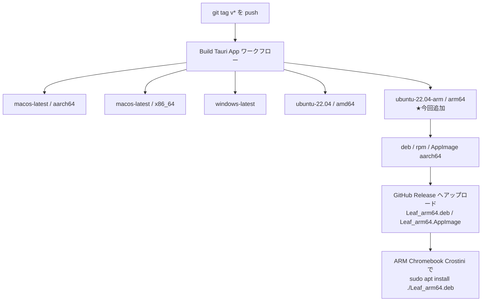

# Linux ARM64（ARM Chromebook / Crostini）向けビルド対応仕様

## 1. 目的

ARM 版 Chromebook の Linux 開発環境（Crostini）で Leaf デスクトップ版を動作させるため、
GitHub Actions のリリースビルドに **Linux aarch64（arm64）** ターゲットを追加する。

## 2. 方式の選定

Tauri 公式の指針では **ARM の AppImage は ARM 実機でしかビルドできず、
ARM 向けのクロスコンパイルはサポートされていない**。
そのため GitHub がホストする ARM64 ランナー（`ubuntu-22.04-arm`）でネイティブビルドする。

| 方式 | 可否 | 備考 |
|---|---|---|
| `ubuntu-22.04-arm` ネイティブビルド | ✅ 採用 | 本リポジトリは public のため ARM64 ホストランナーが無料 |
| x86_64 ランナーでクロスコンパイル（`cross`） | ❌ | webkit2gtk の sysroot 準備が煩雑、AppImage 生成不可 |
| Web 版（PWA）を利用 | △ | 手軽だがターミナル等のデスクトップ限定機能が使えない |



## 3. 変更内容（`.github/workflows/tauri-build.yml`）

### 3-1. matrix にエントリを追加

```yaml
- platform: ubuntu-22.04
  args: ''
  target: ''
  artifact_name: leaf-linux
  linux_arch: amd64
# ARM Chromebook(Crostini) など Linux/ARM64 向け。
# ARM の AppImage は ARM 実機でしかビルドできないため、
# クロスコンパイルではなく GitHub の ARM64 ホストランナーを使う。
- platform: ubuntu-22.04-arm
  args: ''
  target: ''
  artifact_name: leaf-linux-arm64
  linux_arch: arm64
```

既存の amd64 エントリには、固定名アセットの命名に使う `linux_arch` を追加した。

### 3-2. Linux 用ステップの条件を両アーキテクチャ対応に拡張

`matrix.platform == 'ubuntu-22.04'` は arm64 ランナーにマッチしないため、
以下の 3 ステップの条件を `startsWith(matrix.platform, 'ubuntu-')` へ変更。

| ステップ | 内容 |
|---|---|
| Install Linux dependencies | `libwebkit2gtk-4.1-dev` 等の導入 |
| Install wasm-opt (Linux) | `binaryen` の導入 |
| Upload artifacts (Linux) | `deb` / `AppImage` のアーティファクト化 |

### 3-3. 固定名リリースアセットのアーキテクチャ分離

従来は `Leaf_amd64.deb` / `Leaf_amd64.AppImage` 固定だったため、
`matrix.linux_arch` を用いて `Leaf_${arch}.deb` / `Leaf_${arch}.AppImage` を生成する。
AppImage が生成されない構成に備え、存在確認してからアップロード対象に加える。

```yaml
- name: Upload fixed-name release asset (Linux)
  if: startsWith(github.ref, 'refs/tags/') && startsWith(matrix.platform, 'ubuntu-')
  run: |
    arch=${{ matrix.linux_arch }}
    deb=$(ls src-tauri/target/release/bundle/deb/*.deb | head -1)
    cp "$deb" Leaf_${arch}.deb
    assets="Leaf_${arch}.deb"
    # AppImage は生成されない構成もありうるので存在確認してから追加する
    appimage=$(ls src-tauri/target/release/bundle/appimage/*.AppImage 2>/dev/null | head -1)
    if [ -n "$appimage" ]; then
      cp "$appimage" Leaf_${arch}.AppImage
      assets="$assets Leaf_${arch}.AppImage"
    fi
    gh release upload ${{ github.ref_name }} $assets --clobber
```

`tauri-action` が自動で付与するバージョン付きアセット
（`Leaf_0.x.y_arm64.deb` 等）はアーキテクチャ名を含むため、amd64 と衝突しない。

## 4. 生成されるリリースアセット

| ファイル名 | 対象 |
|---|---|
| `Leaf_amd64.deb` / `Leaf_amd64.AppImage` | Linux x86_64（従来どおり） |
| `Leaf_arm64.deb` / `Leaf_arm64.AppImage` | **Linux aarch64（新規）** |
| `Leaf_0.x.y_arm64.deb` / `Leaf-0.x.y-1.aarch64.rpm` | tauri-action の自動アセット（新規） |

## 5. ARM Chromebook（Crostini）での利用条件

| 項目 | 要件 |
|---|---|
| 配布形式 | **`.deb` を推奨**。AppImage は FUSE が必要で Crostini では動かない場合がある |
| ディストリ | Crostini が **Debian bookworm 以降**であること（`libwebkit2gtk-4.1-0` が必要） |
| glibc | Ubuntu 22.04 ビルド（glibc 2.35）→ bookworm（2.36）で動作可。bullseye（2.31）は不可 |
| インストール | `sudo apt install ./Leaf_arm64.deb` |

## 6. 検証観点

| # | 確認内容 | 期待 |
|---|---|---|
| 1 | ワークフローの YAML 構文 | パース成功（js-yaml で確認済み） |
| 2 | タグ push 時、5 ジョブすべてが起動する | macOS×2 / Windows / Linux amd64 / Linux arm64 |
| 3 | `ubuntu-22.04-arm` ジョブが success | aarch64 の deb/rpm/AppImage が生成される |
| 4 | リリースに `Leaf_arm64.deb` が追加される | 固定名アセットが amd64 と別名で共存 |
| 5 | 既存 amd64 アセット名が変わらない | `Leaf_amd64.deb` / `Leaf_amd64.AppImage` のまま |
| 6 | ARM Chromebook 実機でインストール・起動 | 起動しエディタが操作できる（実機確認が必要） |

## 7. 影響範囲

* `.github/workflows/tauri-build.yml` のみ
* アプリケーションコード（`src/`, `src-tauri/`）の変更なし
* 既存プラットフォームのビルド結果・アセット名に変更なし
