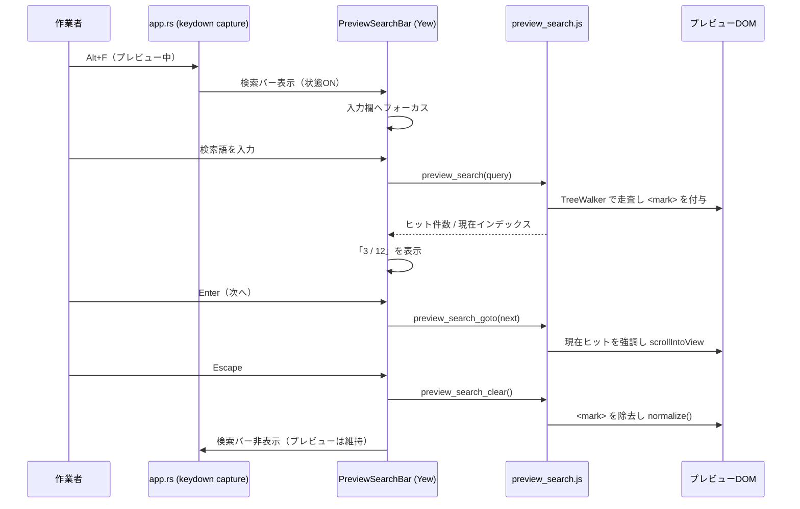

# プレビューモード改修仕様書（検索機能／シート・ファイル開き）

- 対象アプリ: Leaf（Web版 / Tauri版共通）
- 起票日: 2026-07-26
- 対象バージョン: v0.24.1 時点のコードベース

---

## 1. 背景と現状分析

### 1.1 プレビューモードのキー入力処理

全画面プレビュー（`Alt+L`）中のキー入力は `src/app.rs` の window keydown リスナー（capture phase）内、
「Markdownモード中のキー操作」ブロック（`if _preview && !is_overlay_active && atref.borrow().is_none()`）で
**許可リスト方式**で処理されている。

| 種別 | 現状の扱い |
|---|---|
| `Escape` | 編集モードへ復帰 |
| `Alt` + `=` / `-` | プレビュー用フォントサイズ変更 |
| `Alt` + `L` `H` `M` `[` `]` `W` `,` `N` `T` | 許可（通常のショートカット処理へフォールスルー） |
| `PageUp/Down` `↑` `↓` `Space` `Home` `End` | プレビューのスクロール |
| **上記以外すべて** | `preventDefault` + `stopImmediatePropagation` で破棄 |

したがって:

- **`Alt+O`（ローカルファイルを開く）は許可リストに無いため破棄されている** → 要望2の直接原因。
- `Alt+M`（シート選択ダイアログ）は許可リストに含まれておりコード上は通過するが、
  実機で動作しないという報告があるため、実装時に実機検証し原因があれば修正する。

### 1.2 検索機能の現状

`Alt+F` は `exec_editor_command("find")` 経由で **Ace の検索ボックス（ext-searchbox）** を開く実装。
Ace の検索は `EditSession` のテキストを対象とするため、プレビュー（`marked` でレンダリングした HTML）
に対しては機能しない。プレビュー中は `Alt+F` 自体が上記の許可リストで破棄されている。

→ **Ace とは独立した、プレビュー専用の検索 UI を新規実装する必要がある。**

### 1.3 調査中に判明した副次的な不整合（併せて修正したい点）

シートを開く2つの経路（Drive のシート選択 `on_file_sel_cb` / ローカルファイル取込）は、
新規シートの `is_preview` フィールド（`.md` / `.markdown` なら true）は設定するが、
**画面状態 `is_preview_visible` を更新していない**。

結果として:

- プレビュー中にテキストファイルを開くと、プレビュー表示のまま残ってしまう（編集に戻れない）。
- 編集中に `.md` を開いても、シート側の `is_preview=true` と画面状態が食い違う。

要望2（プレビュー中に `Alt+M` / `Alt+O` を使う）を成立させるには、この整合処理が必須。

---

## 2. 要件

| ID | 要件 |
|---|---|
| R1 | 全画面プレビュー中に、Ace に依存しない検索ダイアログを使って本文を検索できる |
| R2 | 全画面プレビュー中に `Alt+M`（シート選択）／`Alt+O`（ローカルファイルを開く）が使える |
| R3 | シート／ファイルを開いた直後、そのシートの `is_preview` に合わせて画面の表示モードを揃える |
| R4 | 追加するすべての文字列を国際化（9言語）対応する |

---

## 3. 仕様: プレビュー内検索（R1）

### 3.1 起動と終了

| 操作 | 動作 |
|---|---|
| プレビュー中に `Alt+F` | 検索バーを表示し、入力欄へフォーカス |
| `Escape` | 検索バーを閉じ、ハイライトを消去（プレビューは維持） |
| `Alt+F`（表示中） | 検索バーを閉じる（トグル） |
| プレビュー終了（`Escape` / `Alt+L`）、シート切替、タブ切替 | 検索バーを自動的に閉じ、ハイライトを消去 |

`Escape` は「検索バーが開いていればまず検索バーを閉じる」を優先し、プレビュー自体は閉じない。

### 3.2 UI

- プレビュー領域の**右上に浮かぶ小型パネル**（既存ダイアログと同じトーン: 濃色背景 + emerald 枠 + 角丸 + シャドウ）。
- 構成要素:
  - 検索語入力欄（オートフォーカス）
  - ヒット件数表示 `3 / 12`（0件時は `0 / 0` と入力欄を警告色に）
  - 前へ / 次へ ボタン（`↑` `↓` アイコン）
  - 大文字小文字の区別トグル（`Aa`。ON時は枠を emerald で強調。既定 OFF、アカウント別に保持）
  - 閉じるボタン（`✕`）
  - キーヒント（`Enter` 次へ / `Shift+Enter` 前へ / `Esc` 閉じる）

### 3.3 検索動作

| 項目 | 仕様 |
|---|---|
| 検索方式 | インクリメンタルサーチ（入力から 150ms デバウンス） |
| 大文字小文字 | 検索バーの `Aa` トグルで切替（既定=区別しない）。設定はアカウント別ストレージに保持 |
| 全角／半角 | 区別する（正規化しない） |
| 次へ / 前へ | `Enter` / `Shift+Enter`、および `↓` `↑` ボタン。末尾→先頭へ循環 |
| ハイライト | 全ヒットを淡色（黄系）、現在ヒットを強調色（橙系）で表示 |
| スクロール | 現在ヒットを `scrollIntoView({ block: "center" })` で画面中央へ |
| 検索対象外 | `<svg>`（Mermaid 図）、`<script>`、`<style>`、既存ハイライト要素 |
| 対象コンテナ | 全画面プレビューのスクロールコンテナ（`InlinePreview` に安定 id を付与して特定） |

### 3.4 実装方式

DOM を直接書き換える方式（TreeWalker でテキストノードを走査し、ヒット箇所を `<mark>` でラップ）を採用する。

- 理由: `CSS Custom Highlight API` は DOM 非破壊で理想的だが、Linux の WebKitGTK など
  Tauri のシステム WebView のバージョン差でサポートが読めないため、全環境で確実に動く方式を選ぶ。
- 復元は `<mark>` をテキストノードへ戻し `parent.normalize()` を呼ぶ。SVG を対象外にするため
  Mermaid の再描画は不要。
- プレビュー本文が再レンダリングされた場合はハイライトを破棄して再検索する。

### 3.5 処理フロー

### 3.6 変更・追加ファイル

| ファイル | 内容 |
|---|---|
| `assets/js/preview_search.js`（新規） | ハイライト・件数・移動・クリアのロジック |
| `src/js_interop.rs` | 上記 JS の `extern` バインディング追加 |
| `src/components/preview_search.rs`（新規） | 検索バー UI コンポーネント |
| `src/components/mod.rs` | モジュール登録 |
| `src/app.rs` | 検索バー表示状態、`Alt+F` の分岐、`Escape` の優先順位、プレビュー終了時のクリア、レンダリング |
| `src/app.rs`（`InlinePreview`） | 全画面プレビューのスクロールコンテナに id 付与 |
| `assets/css/input.css` | ハイライト用スタイル（`markdown-body` の背景 `#fdf6e3` に合わせた配色） |
| `src/i18n.rs` | 新規メッセージキー（9言語） |
| `assets/js/sw.js` | Service Worker キャッシュ版数を v17 → v18 |

### 3.7 追加する i18n キー（案）

| キー | ja | en |
|---|---|---|
| `preview_search_placeholder` | プレビュー内を検索 | Search in preview |
| `preview_search_no_match` | 見つかりません | No matches |
| `preview_search_next` | 次へ | Next |
| `preview_search_prev` | 前へ | Previous |
| `preview_search_match_case` | 大文字小文字を区別 | Match case |

（zh / ko / es / de / fr / it / nl も同時に追加）

### 3.8 対象外

- **分割プレビュー（スプリット表示）中の右ペイン検索は対象外**。
  分割時はフォーカスがエディタ側にあり `Alt+F` は従来どおり Ace の検索を開く。
- 置換機能、正規表現検索は対象外。

---

## 4. 仕様: プレビュー中の `Alt+M` / `Alt+O`（R2 / R3）

1. プレビュー中の許可リストに `Alt+O`（`KeyO` / `o` / `ø`）を追加し、既存の
   「ローカルファイルを開く」処理へフォールスルーさせる。
2. `Alt+M` は実機検証の結果 Web 版では既に動作していた（許可リストに含まれているため）。
   合わせて、アクティブシート自身を再選択した場合は表示モードを変更しない（現在の表示を維持する）。
3. シートを開いた直後の表示モード整合（R3）:
   - Drive シート選択 (`on_file_sel_cb`) とローカルファイル取込の両経路で、
     開いたシートの `is_preview` に合わせて `is_preview_visible` と
     `preview_overlay_opacity`（フェード制御）を設定する。
   - `.md` / `.markdown` を開いた場合はプレビュー表示、それ以外は編集表示になる。
4. 検索バーが開いている状態で `Alt+M` / `Alt+O` を押した場合は、検索バーを閉じてから
   ダイアログ／ファイル選択を開く。

---

## 5. テスト項目

| # | 内容 | 期待結果 |
|---|---|---|
| 1 | プレビュー中に `Alt+F` | 検索バーが開き入力できる |
| 2 | 検索語を入力 | 全ヒットがハイライトされ件数が出る |
| 3 | `Enter` / `Shift+Enter` | 次／前のヒットへ移動し循環する |
| 4 | ヒット0件 | `0 / 0` 表示・警告色、例外が出ない |
| 5 | Mermaid 図・コードブロックを含む文書 | 図が壊れない、コードブロック内も検索できる |
| 6 | 検索中に `Escape` | 検索バーのみ閉じ、プレビューは維持、ハイライト消去 |
| 7 | 検索中に `Alt+L` | プレビュー終了・ハイライト消去・編集へ復帰 |
| 8 | プレビュー中に `Alt+M` → シート選択 | ダイアログが開き、選択後は開いたシートの表示モードになる |
| 9 | プレビュー中に `Alt+O` → ファイル選択 | ローカルファイルが開き、`.txt` なら編集表示、`.md` ならプレビュー表示 |
| 10 | 分割プレビュー中に `Alt+F` | 従来どおり Ace の検索ボックスが開く |
| 10b | `Aa` トグル ON/OFF | 大文字小文字の区別が切り替わり、再起動後も設定が保持される |
| 11 | 9言語で表示 | 文字列が各言語で表示される |
| 12 | Web版 / Tauri版 | 双方で同一動作 |

---

## 6. 決定事項（2026-07-26 作業者確認済み）

1. 大文字小文字: 検索バーに `Aa` トグルを設ける（既定は区別しない）。
2. 対応範囲: 全画面プレビューのみ。分割プレビューの右ペインは対象外（`Alt+F` は従来どおり Ace の検索）。
3. ハイライト配色: 全ヒット=黄系 / 現在ヒット=橙系。表示位置: プレビュー右上の浮動パネル。
