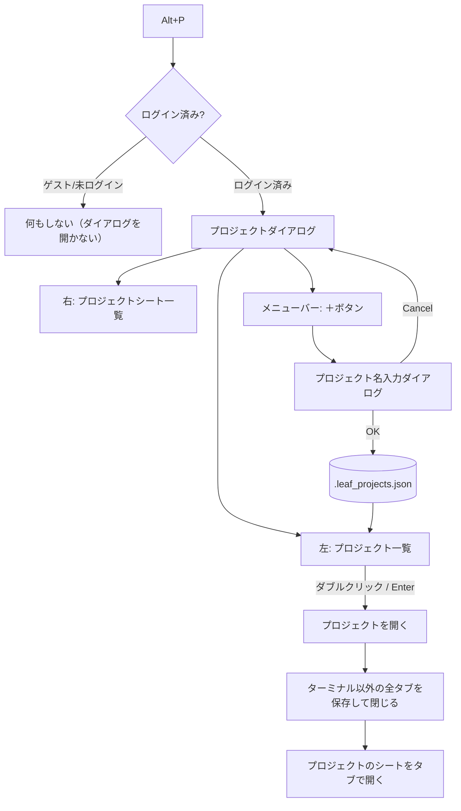
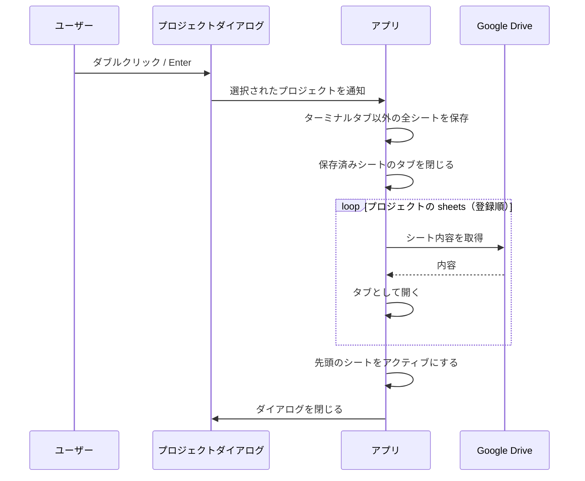
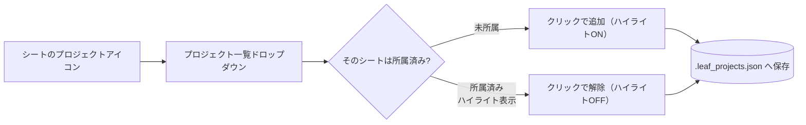
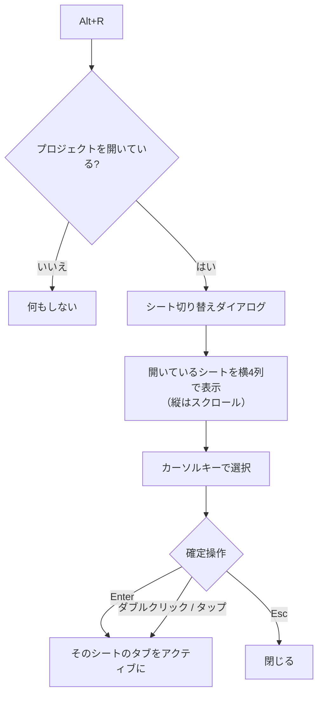
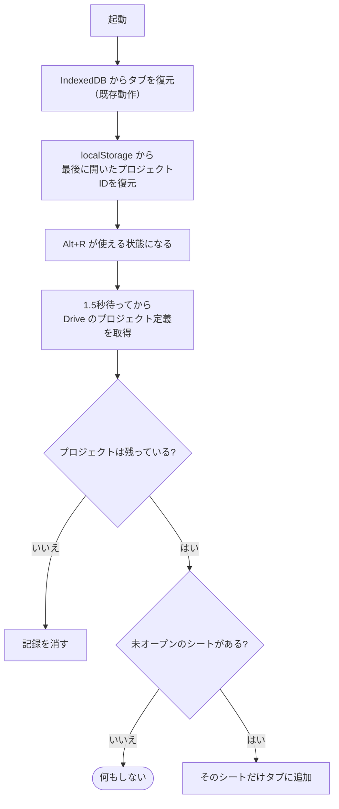

# プロジェクト機能 仕様書

## 1. 概要

複数のシートを「プロジェクト」としてまとめ、プロジェクトを選ぶだけで
関連シートをタブとして一括で開けるようにする。

プロジェクトの定義は Google ドライブのアプリケーションフォルダに
ドットファイルとして保存するため、**Google ドライブへログインしている場合のみ利用できる**。



## 2. データ設計

### 2-1. 保存先

| 項目 | 値 |
|---|---|
| 保存先フォルダ | Leaf アプリケーションフォルダ（`leaf_data_folder_id`） |
| ファイル名 | `.leaf_projects.json` |
| 形式 | UTF-8 / JSON |

先頭がドットのため、既存のシート一覧（カテゴリーフォルダ配下を走査）には現れない。
アプリケーションフォルダ直下に置くため、カテゴリーとしても表示されない。

### 2-2. スキーマ

```json
{
  "version": 1,
  "projects": [
    {
      "id": "550e8400-e29b-41d4-a716-446655440000",
      "name": "サンプルプロジェクト",
      "memo": "次期リリース用",
      "sheets": ["<sheet-guid>", "<sheet-guid>"],
      "created_at": 1750000000000,
      "updated_at": 1750000000000
    }
  ],
  "previews": {
    "<sheet-guid>": "会議メモ\n・議題\n・決定事項"
  }
}
```

| フィールド | 型 | 説明 |
|---|---|---|
| `version` | number | スキーマ版数。将来の移行用 |
| `id` | string | プロジェクトの GUID。シートと同じく GUID で管理する |
| `name` | string | プロジェクト名。**ユニーク制約あり** |
| `memo` | string | 自由記述のメモ。一覧でプロジェクト名の下に表示する。ユニーク制約なし |
| `sheets` | string[] | 所属シートの `guid` の配列。**追加順を保持**（タブを開く順序になる） |
| `created_at` / `updated_at` | number | UNIX ミリ秒 |
| `previews` | object | guid → 本文の先頭 5 行。一覧表示用のキャッシュ（2-5） |

### 2-3. シートの参照方法

シートは `Sheet.guid`（Drive 上のファイル名から拡張子を除いた値）で参照する。
`drive_id` ではなく `guid` を使う理由は、`drive_id` はファイルを再作成すると変わるのに対し、
`guid` はシートの同一性を表す安定した識別子であるため。

`guid` を持たないシート（ローカルシート・未保存シート）はプロジェクトへ追加できない。

### 2-4. 名前のユニーク制約

* 前後の空白を除去した上で比較する（保存時も trim 済みの名前を使う）
* **大文字小文字は区別する**（`Project` と `project` は別プロジェクトとして共存できる）
* 空文字（空白のみ）は不可
* 重複・空文字の場合はエラーメッセージを表示し、入力ダイアログは閉じない

### 2-5. 本文プレビューのキャッシュ

Drive 上のファイル名は `{guid}.{拡張子}` で内容が分からないため、
**guid を見ても何のシートか判別できない**。そのため一覧には本文の先頭 5 行を表示する。

* シートをプロジェクトへ追加した時点で、シート選択ダイアログが取得済みの本文から
  先頭 5 行（1 行あたり 80 文字まで）を控えて `previews` に保存する
* プロジェクトダイアログでは、開いているシートについては現在の本文から作り直した
  プレビューを優先して表示する（保存済みより新しいため）
* あくまでキャッシュであり、欠けていても機能に影響はない（その場合のみ guid を表示する）
* どのプロジェクトからも参照されなくなったプレビューは削除される

## 3. 画面仕様

### 3-1. プロジェクトダイアログ（Alt+P）

シート選択ダイアログと同じく全画面で開く。

```
┌──────────────────────────────────────────────┐
│ [＋]                                          │ ← メニューバー
├───────────────────────┬──────────────────────┤
│ プロジェクト一覧        │ プロジェクトシート一覧  │
│ （縦並び・スクロール）   │ （縦並び・スクロール）  │
│                       │                      │
│ ▸ ProjectA  [✎][✕]   │  sheet1.txt      [✕] │
│ ▸ ProjectB  [✎][✕]   │  sheet2.md       [✕] │
│                       │                      │
├───────────────────────┴──────────────────────┤
│                                    [Cancel]  │ ← フッター
└──────────────────────────────────────────────┘
```

| 領域 | 内容 |
|---|---|
| メニューバー | 最上部。今回は「＋」ボタンのみ配置（将来の拡張余地を残す） |
| 左 50% | プロジェクト一覧。縦に並べ、件数が増えたら縦スクロール。各行はプロジェクト名の下に一回り小さいフォントでメモを表示し、右端に所属シート数を出す |
| 右 50% | 選択中プロジェクトのシート一覧。縦に並べ、縦スクロール。**各シートは本文の先頭 5 行**で表示する |

### 3-2. 操作一覧

| 操作 | 挙動 |
|---|---|
| 「＋」クリック | プロジェクト名入力ダイアログを開く |
| プロジェクトをクリック | 選択状態にし、右側にそのプロジェクトのシート一覧を表示 |
| プロジェクトをダブルクリック | **プロジェクトを開く**（4章）。シートが 0 件なら何もしない |
| プロジェクト選択中に Enter | **プロジェクトを開く**（4章）。シートが 0 件なら何もしない |
| ✎（鉛筆）クリック | プロジェクト名変更ダイアログ（現在名を初期値としてセット） |
| ✕ クリック | 確認ダイアログの後に削除 |
| ↑ / ↓ | プロジェクト一覧の選択移動 |
| Esc | ダイアログを閉じる |
| 右側シートの ✕ | そのシートをプロジェクトから外す（シート自体は削除しない） |

### 3-3. プロジェクト名入力ダイアログ

入力項目は 2 つ。

| 項目 | 必須 | 説明 |
|---|---|---|
| プロジェクト名 | 必須 | ユニーク制約あり |
| メモ | 任意 | 複数行入力。一覧でプロジェクト名の下に表示される |

* ボタンは**左に Cancel、右に OK**
* Cancel: 何もせずに閉じる
* OK: 名前を検証し、問題なければ設定ファイルへ記録して一覧へ反映
* 検証エラー時はダイアログを開いたままエラーメッセージを表示
* Enter で確定するが、メモ欄（複数行）にフォーカスがある時は改行として扱う

新規作成・名前変更で同じダイアログを使う（タイトルと初期値のみ差し替え）。
名前変更時はメモも同時に編集できる。

### 3-4. プロジェクト削除の確認ダイアログ

「プロジェクト "◯◯" を削除しますか？」を表示し、OK でのみ削除する。
削除されるのはプロジェクト定義のみで、**シート本体は削除しない**。

## 4. プロジェクトを開く

プロジェクトがダブルクリックまたは Enter で確定された時の処理。

### 4-1. 開ける条件

**シートが 1 件も追加されていないプロジェクトは開けない。**
全タブを閉じた結果として空のシートが 1 枚できるだけで意味がないため。

* ダブルクリック / Enter を無視する（ダイアログは開いたまま）
* 一覧では該当プロジェクトを淡色表示にし、開けないことが分かるようにする
* Drive 上からシートが全て消えた場合（`prune_missing_sheets` 後）も同様に開けなくなる

判定は `ProjectStore::is_openable()` に集約する。

### 4-2. 開く処理



補足仕様:

* **ターミナルタブは閉じない**（実行中のシェルを失わないため）
* 保存はターミナル以外の全タブに対して行う。未保存の新規シート（`guid` も `drive_id` も無い）は
  既存の保存フローに従う
* プロジェクトのシートが Drive 上に存在しない場合はスキップし、設定ファイルからも取り除く
* シートが 0 件のプロジェクトはそもそも開けない（4-1）

## 5. シートをプロジェクトへ追加する

シート選択ダイアログ（Alt+M）の各シートに配置されている 3 つのアイコン
（カテゴリー / ファイルタイプ / 削除）に、**プロジェクトアイコンを 1 つ追加**する。



* ドロップダウンには全プロジェクトを表示する
* そのシートが所属しているプロジェクトは**ハイライト**する
* ハイライトされている項目を再クリックすると、そのプロジェクトから外れる
* プロジェクトが 0 件の場合は「プロジェクトがありません」を表示する
* `guid` を持たないシートではアイコンを無効化する（ローカル・未保存シート）

## 6. 権限・利用条件

| 状態 | 挙動 |
|---|---|
| Google ドライブへログイン済み | 全機能が利用できる |
| ゲストモード | Alt+P を無視する（ダイアログを開かない） |
| 未ログイン | 同上 |

シート選択ダイアログのプロジェクトアイコンも、同条件で非表示にする。

## 7. モジュール構成

| ファイル | 役割 |
|---|---|
| `src/project.rs`（新規） | プロジェクトのデータモデルと操作（**副作用なし・単体テスト対象**） |
| `src/project_store.rs`（新規） | Drive との読み書き（`.leaf_projects.json` のロード／セーブ） |
| `src/components/project_dialog.rs`（新規） | プロジェクトダイアログ UI と名前・メモ入力ダイアログ |
| `src/components/file_open_dialog.rs` | プロジェクトアイコンとドロップダウンの追加 |
| `src/app.rs` | Alt+P のキーハンドラ、プロジェクトを開く処理、状態管理 |
| `src/i18n.rs` | 追加メッセージの国際化（9 言語） |

ビジネスロジック（検証・追加・削除・所属判定）は全て `src/project.rs` の
純粋関数として実装し、UI と Drive アクセスから切り離してテスト可能にする。

## 8. テスト

`src/project.rs` に `#[cfg(test)]` の単体テストを追加する（`cargo test` で実行）。

| # | 対象 | 内容 | 期待 |
|---|---|---|---|
| 1 | `add` | 新規プロジェクト追加 | 一覧に追加され GUID が採番される |
| 2 | `add` | 空文字・空白のみ | `Err(Empty)` |
| 3 | `add` | 既存と同名 | `Err(Duplicate)` |
| 4 | `add` | 既存と大文字小文字違い | 成功する（区別するため別名扱い） |
| 5 | `add` | 前後に空白がある同名 | `Err(Duplicate)`、保存時は trim される |
| 6 | `rename` | 別名へ変更 | 成功し `updated_at` が更新される |
| 7 | `rename` | 自分自身と同じ名前 | 成功する（自分は重複判定から除外） |
| 8 | `rename` | 他プロジェクトと同名 | `Err(Duplicate)` |
| 9 | `remove` | 削除 | 一覧から消える |
| 10 | `toggle_sheet` | 未所属シート | 追加され `true` を返す |
| 11 | `toggle_sheet` | 所属済みシート | 外れて `false` を返す |
| 12 | `toggle_sheet` | 同じシートを 2 回追加しない | 重複登録されない |
| 13 | `sheets` | 追加順の保持 | 登録順どおりに返る |
| 14 | `projects_for_sheet` | 複数プロジェクトに所属 | 該当する全プロジェクトが返る |
| 15 | `prune_missing_sheets` | 存在しない guid を除去 | 生存する guid だけが残る |
| 15a | `is_openable` | 作成直後（シート 0 件） | `false` |
| 15b | `is_openable` | シートを追加／全て外す | `true` → `false` |
| 15c | `is_openable` | 存在しないプロジェクト ID | `false` |
| 15d | `is_openable` | prune で全シートが消えた場合 | `false` |
| 15e | `add` | メモを保存 | trim して保存される。ユニーク制約なし |
| 15f | `update` | 名前とメモを同時更新 | 両方が変わり `updated_at` が進む |
| 15g | `update` | メモを空にする | 空文字になる |
| 15h | `preview_from_content` | 先頭 5 行だけ・1 行 80 文字で打ち切り | 期待どおり切り詰められる |
| 15i | `set_sheet_preview` | 同じ内容の再設定 | `false`（保存不要） |
| 15j | `set_sheet_preview` | 空の本文 | 既存のプレビューを上書きしない |
| 15k | `prune_missing_sheets` | 参照されないプレビュー | 併せて削除される |
| 16 | JSON | シリアライズ→デシリアライズ | 元の内容と一致する（メモ・プレビュー含む） |
| 17 | JSON | 未知フィールドを含む JSON | エラーにならず読める（前方互換） |
| 18 | JSON | 壊れた JSON | 空の一覧として扱う（データ消失を防ぐためエラーにしない） |

### 手動確認（UI 部分）

| # | 確認内容 | 期待 |
|---|---|---|
| 1 | ゲストモードで Alt+P | ダイアログが開かない |
| 2 | ログイン状態で Alt+P | プロジェクトダイアログが全画面で開く |
| 3 | ＋ → 名前とメモを入力 → OK | 左側に追加され、名前の下にメモが小さく表示される |
| 4 | ＋ → Cancel | 何も起きない |
| 5 | 同名で作成 | エラー表示、ダイアログは閉じない |
| 6 | ✎ で名前・メモを変更 | 一覧に反映される |
| 6a | 右ペインのシート表示 | guid ではなく本文の先頭 5 行が出る |
| 7 | ✕ → 確認 OK | 一覧から消える。シート本体は残る |
| 8 | Alt+M のシートでプロジェクトアイコン | ドロップダウンに一覧が出る |
| 9 | ドロップダウンで選択 | 右側のシート一覧に現れる |
| 10 | 所属済み項目を再クリック | 外れる |
| 11 | 右側シートの ✕ | プロジェクトから外れる |
| 12 | プロジェクトをダブルクリック | 他タブが保存・クローズされ、プロジェクトのシートが開く |
| 12a | シート 0 件のプロジェクトをダブルクリック / Enter | 何も起きない（淡色表示で開けないと分かる） |
| 13 | ターミナルを開いた状態で 12 | ターミナルタブは残る |
| 14 | 別デバイスで開く | 同じプロジェクト構成が見える（Drive 同期） |

## 9. 影響範囲

* 既存のシート・カテゴリーのデータ構造は変更しない
* `Sheet` 構造体にもフィールドを追加しない（所属情報はプロジェクト側が持つ）
* Web 版・デスクトップ版の双方で動作する（Drive ログインが前提）

---

## 10. プロジェクト表示中のシート切り替えダイアログ（Alt+R）

### 10-1. 概要

プロジェクトを開いている状態で `Alt+R` を押すと、タブで開いているシートを
「書類」風のカードで一覧するダイアログが降りてきて、カーソルキーで選んで
そのタブへ切り替えられる。



### 10-2. ダイアログの外観

| 項目 | 仕様 |
|---|---|
| 幅 | ウィンドウ幅の **80%** |
| 高さ | ウィンドウ高さの **90%** |
| 位置 | 上端から表示 |
| 登場 | 上から **0.1 秒**でロールダウン |
| 並び | 横 **4 列**固定。縦はスクロール |

### 10-3. シートカード

* 縦横比は **横 : 縦 = 1 : 1**（`aspect-square`）の書類を模した見た目
* 拡張子に応じて見た目を変える

| 拡張子 | 見た目（`DocStyle`） |
|---|---|
| `.md` / `.markdown` | Markdown（見出し行を強調した書類） |
| `.txt` / `.text` / `.log` / `.csv` / 拡張子なし | プレーンテキスト |
| 上記以外（`.rs` / `.js` など） | ソースコード（行番号付きの書類） |

* カードの中身はプレビュー画面と同じレンダラ（marked / highlight.js）で描画し、
  `zoom` で縮小してフルサイズの書類の組版を保ったまま収める
* カード上端に拡張子ラベルとタブ色を表示する
* 現在アクティブなシートは判別できるように印を付ける

### 10-4. 操作

| 操作 | 挙動 |
|---|---|
| ← / → | 1 枚ずつ移動（行末の次は次行の先頭） |
| ↑ / ↓ | 1 行（4 枚）分移動 |
| Enter | 選択中のシートのタブをアクティブにして閉じる |
| ダブルクリック / タップ | 同上 |
| Esc | 何もせずに閉じる |
| Alt+R | 開いている場合は閉じる（トグル） |

* 端では移動を止める（ラップアラウンドしない）
* 最終行が埋まっていない場合、真下が無い位置から ↓ を押したら末尾のカードへ寄せる
* アクティブにしたシートの編集／プレビュー状態は、そのシートに保存された状態を
  そのまま適用する（既存のタブ切り替えと同じ挙動）

### 10-5. 対象シート

* タブで開いている**シートのみ**を対象とし、**ターミナルタブは含めない**
  （シートのプレビューを見て選ぶ画面のため）

### 10-6. 実装方針

| ファイル | 役割 |
|---|---|
| `src/components/project_sheet_switcher.rs`（新規） | 選択位置の計算（純粋関数・**テスト対象**）とダイアログ UI |
| `src/app.rs` | `Alt+R` の分岐、開いているプロジェクトの保持、タブ切り替えの委譲 |

* 開いているプロジェクトを `active_project_id` として保持し、`Alt+R` の有効・無効に使う
* タブの切り替えは既存の `on_tab_select_cb` に委譲する（表示状態の復元も既存処理に任せる）

### 10-7. テスト

`move_selection()` / `DocStyle::from_extension()` / `display_extension()` を単体テストする。

| # | 対象 | 内容 | 期待 |
|---|---|---|---|
| 1 | ← / → | 行をまたいで 1 枚ずつ移動 | index 3 → 4、4 → 3 |
| 2 | ← / → | 先頭・末尾 | 動かない |
| 3 | ↑ / ↓ | 1 行分移動 | 0 → 4 → 8 |
| 4 | ↑ | 先頭行 | 動かない |
| 5 | ↓ | 最終行 | 動かない |
| 6 | ↓ | 最終行が途中まで（10 枚） | index 6 → 9（末尾へ寄せる） |
| 7 | ↑ / ↓ | 1 行しかない | 動かない |
| 8 | 異常系 | 0 枚 / 範囲外の index / 0 列 | パニックせず安全な値 |
| 9 | `DocStyle` | 拡張子ごとの判定 | md→Markdown、txt→Text、rs→Code |
| 10 | `display_extension` | 拡張子の抽出 | `memo.txt`→`TXT`、`Makefile`→空 |

### 10-8. 手動確認

| # | 確認内容 | 期待 |
|---|---|---|
| 1 | プロジェクト未使用で Alt+R | 何も起きない |
| 2 | プロジェクトを開いた後に Alt+R | ダイアログが上から 0.1 秒で降りてくる |
| 3 | サイズ | 幅 80% / 高さ 90% |
| 4 | カード | 横 4 列・縦スクロール・縦横比 1:1 |
| 5 | 拡張子違いのシート | .md / .txt / .rs で見た目が変わる |
| 6 | カーソルキー | 選択が移動する |
| 7 | Enter | そのタブがアクティブになる |
| 8 | ダブルクリック / タップ | 同上 |
| 9 | Esc / Alt+R | 閉じる |
| 10 | ターミナルを開いた状態 | グリッドにターミナルは出ない |
| 11 | デスクトップ版のヘッダー文字 | Web 版と同程度の見やすさ（`is_tauri()` で一回り大きくする） |

---

## 11. 開いていたプロジェクトの復元

### 11-1. 方針

再読み込み・再起動しても、前回開いていたプロジェクトの状態が続くようにする。

**タブ自体は既に IndexedDB から復元される**ため開き直さない。
起動のたびに Drive から全シートを取り直すのは遅く、プロジェクト外で開いていた
シートを勝手に閉じてしまうため。



### 11-2. 保存内容

| 項目 | 保存先 | キー |
|---|---|---|
| 最後に開いたプロジェクト ID | localStorage（アカウント単位） | `leaf_active_project` |

プロジェクトを開いた時点で書き込み、削除されていた場合は起動時に消す。

### 11-3. 差分の反映

他の端末でプロジェクトへシートを追加していた場合に取りこぼさないよう、
プロジェクトの所属シートのうち**まだ開いていないもの**だけを後から追加で開く。

* 判定は `Project::missing_sheets()`（純粋関数・**テスト対象**）
* 既存のタブは閉じない。アクティブタブも変えない（末尾へ追加するだけ）
* Drive 取得中に同じシートが開かれた場合に備え、追加の直前にもう一度重複を除く
* 起動直後は IndexedDB からのタブ復元と競合するため、1.5 秒待ってから実行する

### 11-4. テスト

| # | 対象 | 内容 | 期待 |
|---|---|---|---|
| 1 | `missing_sheets` | 何も開いていない | 登録順で全件 |
| 2 | `missing_sheets` | 一部だけ開いている | 残りだけを登録順で |
| 3 | `missing_sheets` | 全部開いている | 空 |
| 4 | `missing_sheets` | プロジェクト外のシートが開いている | 影響しない |
| 5 | `missing_sheets` | シート 0 件のプロジェクト | 空 |

### 11-5. 手動確認

| # | 確認内容 | 期待 |
|---|---|---|
| 1 | プロジェクトを開いてブラウザをリロード | タブがそのまま復元され、Alt+R が使える |
| 2 | アプリ版を再起動 | 同上 |
| 3 | 別端末でプロジェクトにシートを追加してから起動 | そのシートがタブに追加される |
| 4 | プロジェクトを削除してから起動 | Alt+R が無効に戻る（エラーにならない） |
| 5 | プロジェクトを一度も開いていない状態で起動 | 何も起きない |
