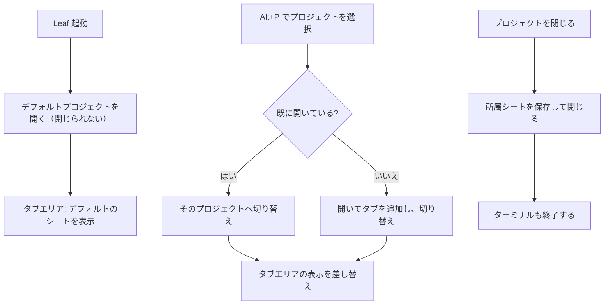

# プロジェクトをワークスペースとして扱う 仕様書

## 1. 目的

これまで「プロジェクトを開く＝他のタブを閉じて入れ替える」だったものを、
**プロジェクトを並列に開いておき、切り替えで表示を差し替える**方式へ変更する。

ブラウザのタブグループに近い考え方で、開いているシートは常にいずれかの
プロジェクトに属し、タブエリアには**現在のプロジェクトのシートだけ**が並ぶ。



## 2. 画面構成

```
┌─────────────┬──────────────┬────────────────────────────────┐
│ ターミナル ▾ │ ProjectA ▾   │  sheet1   sheet2   sheet3  ...  │
└─────────────┴──────────────┴────────────────────────────────┘
   左端に固定     現在のプロジェクト     現在のプロジェクトのシート
   （移動不可）    （移動不可）          （ドラッグで並べ替え可能）
```

| 要素 | 内容 |
|---|---|
| ターミナルタブ | **現在のプロジェクトの**ターミナル一覧。デスクトップ版のみ |
| プロジェクトタブ | 現在のプロジェクト名を表示。ドロップダウンは**開いているプロジェクトの一覧**（切り替え／閉じる） |
| シートタブ | 現在のプロジェクトのシート。従来どおりの見た目・並べ替え |

* シートの実体は全プロジェクト分をメモリに保持し、**切り替えでは Drive から取得し直さない**
* タブの並び順は既存の `tab_order` をプロジェクトで絞り込んで使う

## 3. デフォルトプロジェクト

| 項目 | 仕様 |
|---|---|
| ID | `__default__`（固定） |
| 名前 | i18n の「デフォルト」（言語ごとに表示。設定ファイルには保存しない） |
| 作成 | 起動時に存在しなければ自動作成する |
| 閉じる | **不可**（常に開いている） |
| 削除・改名 | **不可** |
| 一覧表示 | Alt+P の一覧には表示する（切り替え先として選べる必要があるため） |

これにより「プロジェクトを開いていない状態」が無くなり、開いているシートは必ず
いずれかのプロジェクトに属する。

## 4. 操作

| 操作 | 挙動 |
|---|---|
| Alt+P → プロジェクトを選択 | 開いていなければ開き、開いていれば**切り替える** |
| プロジェクトタブのドロップダウン | 開いているプロジェクトの一覧。選ぶと切り替え |
| ドロップダウンの ✕ | そのプロジェクトを閉じる（デフォルトには表示しない） |
| Alt+M でシートを選択 | **現在のプロジェクトに追加**して開く |
| シートタブの ✕ | シートを閉じ、**現在のプロジェクトからも外す** |
| Alt+R | 現在のプロジェクトのターミナルとシートを一覧表示 |
| Alt+T | 現在のプロジェクトのターミナルを表示／無ければ起動 |

### 4-1. プロジェクトを閉じる

1. 所属シートのうち未保存のものを保存する
2. 所属シートのタブを閉じ、エディタのセッションを破棄する
3. そのプロジェクトのターミナルを終了する
4. プロジェクトタブを消し、直前に見ていたプロジェクト（無ければデフォルト）へ切り替える

デフォルトプロジェクトは閉じられない。

### 4-2. シートの重複を作らない

1 つのシートは設定上は複数のプロジェクトに所属できるが、**画面には 1 箇所にしか出さない**。
既に別の開いているプロジェクトで開かれているシートを選んだ場合は、
新しく開かず**そのプロジェクトへ切り替えて、当該シートを選択状態にする**。

判定は「開いているプロジェクトを順に見て、最初に所属しているもの」を所有者とする。

## 5. ターミナル

| 項目 | 仕様 |
|---|---|
| 所属 | 起動した時点の**現在のプロジェクト**に属する |
| 表示 | ターミナルタブのドロップダウンには現在のプロジェクトのものだけを出す |
| Alt+R | シート一覧の**左上（先頭）**にターミナルを並べる |
| 同一性 | Alt+R に出るターミナルとターミナルタブのものは**同じ実体**を指す |
| プロジェクトを閉じた時 | そのプロジェクトのターミナルを終了する |
| 設定ファイル | **保存しない**（シェルのプロセスは復元できないため、実行時のみの関連付け） |

## 6. 起動時の復元

| 保存項目 | 保存先 | キー |
|---|---|---|
| 開いていたプロジェクトの一覧 | localStorage（アカウント単位） | `leaf_open_projects` |
| アクティブなプロジェクト | localStorage（アカウント単位） | `leaf_active_project` |

* デフォルトプロジェクトは常に開いた状態にする
* 保存されていたプロジェクトが削除されていた場合は一覧から取り除く
* シート自体は従来どおり IndexedDB から復元し、所属に応じて各プロジェクトへ振り分ける

## 7. モジュール構成

| ファイル | 役割 |
|---|---|
| `src/project.rs` | デフォルトプロジェクトの扱い（作成・削除/改名の禁止）を追加 |
| `src/workspace.rs`（新規） | 開いているプロジェクトの集合と切り替え（**副作用なし・単体テスト対象**） |
| `src/tabs.rs` | 現在のプロジェクトのタブだけを取り出す振り分け |
| `src/components/tab_bar.rs` | プロジェクトタブのドロップダウンを「開いているプロジェクト一覧」へ変更 |
| `src/components/project_sheet_switcher.rs` | Alt+R の先頭にターミナルを追加 |
| `src/app.rs` | 状態管理、切り替え・閉じる処理、Alt+M の所属追加 |
| `src/i18n.rs` | 「デフォルト」等の追加メッセージ（9 言語） |

## 8. テスト

### 8-1. `src/project.rs`

| # | 対象 | 内容 | 期待 |
|---|---|---|---|
| 1 | `ensure_default` | 未作成の状態 | デフォルトが作成され true |
| 2 | `ensure_default` | 既にある状態 | 何もせず false |
| 3 | `remove` | デフォルトを削除 | 拒否され、一覧に残る |
| 4 | `update` | デフォルトを改名 | 拒否され、名前が変わらない |
| 5 | `is_default` | 判定 | ID が一致する時のみ true |

### 8-2. `src/workspace.rs`

| # | 対象 | 内容 | 期待 |
|---|---|---|---|
| 6 | `open` | 未オープンのプロジェクト | 末尾に追加され、アクティブになる |
| 7 | `open` | 既にオープン済み | 重複せず、アクティブが切り替わるだけ |
| 8 | `close` | 通常のプロジェクト | 一覧から消え、直前のプロジェクトがアクティブに |
| 9 | `close` | デフォルト | 拒否される |
| 10 | `close` | アクティブでないもの | アクティブは変わらない |
| 11 | `switch` | 開いていないID | 何も起きない |
| 12 | `restore` | 保存値にデフォルトが無い | デフォルトが必ず先頭に入る |
| 13 | `restore` | 削除済みIDが混在 | 存在するものだけが残る |
| 14 | `owner_of` | 複数プロジェクトに所属 | 開いている順で最初のものを返す |
| 15 | `owner_of` | どこにも所属しない | None |

### 8-3. 手動確認

| # | 確認内容 | 期待 |
|---|---|---|
| 1 | 起動直後 | デフォルトプロジェクトが開いている |
| 2 | Alt+M でシートを開く | 現在のプロジェクトに追加され、タブに出る |
| 3 | Alt+P で別プロジェクトを開く | タブが増え、タブエリアの表示が入れ替わる |
| 4 | プロジェクトタブのドロップダウンで切り替え | 表示が一瞬で切り替わる（再取得しない） |
| 5 | 切り替えて戻る | 直前に見ていたシートが選択されている |
| 6 | シートタブの ✕ | 閉じ、プロジェクトからも外れる |
| 7 | プロジェクトを閉じる | 所属シートが保存されて閉じ、ターミナルも終了する |
| 8 | デフォルトを閉じようとする | 閉じられない（✕ が出ない） |
| 9 | 別プロジェクトで開いているシートを選択 | 重複せず、そのプロジェクトへ切り替わる |
| 10 | Alt+R | 左上にターミナル、続けてシートが並ぶ |
| 11 | 再起動 | 開いていたプロジェクトとアクティブなものが復元される |

## 9. 影響範囲

* `.leaf_projects.json` の構造は変更しない（デフォルトプロジェクトが 1 件増えるのみ）
* シートの保存形式（IndexedDB / Drive）は変更しない
* Web 版・デスクトップ版の双方で動作する（ターミナルはデスクトップ版のみ）
