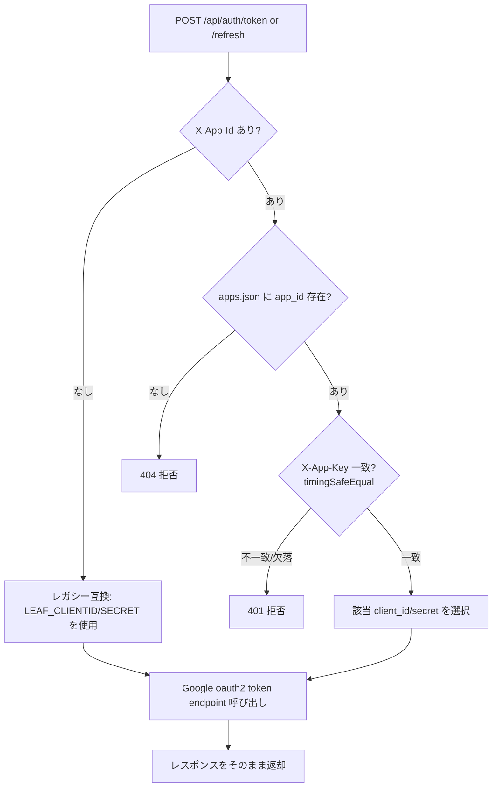

# 認証プロキシ マルチアプリ共用 仕様書

## 1. 目的

現在 Leaf 専用となっているトークン交換／サイレント更新サーバー（`server/index.js`）を、
**作業者が作成する複数アプリで共用**できるようにする。各アプリは**別々の Google Cloud プロジェクト**
（＝別々の OAuth クライアント）を持つため、サーバー側でアプリごとのクレデンシャルを切り替える
マルチテナント方式とする。

## 2. 現状（As-Is）

- エンドポイント
  - `POST /api/auth/token` … 認可コード → トークン交換
  - `POST /api/auth/refresh` … リフレッシュトークンで更新（サイレント更新）
- クレデンシャルは `.env` の **1組固定**
  ```
  LEAF_CLIENTID / LEAF_CLIENT_SECRET
  ```
- Google はリフレッシュトークンを「発行時の client_id / client_secret ペア」に紐付けて検証するため、
  別 OAuth クライアントのトークンはこのサーバーでは更新できない → **実質 Leaf 専用**。
- **認証なし**（誰でも POST 可能）、`cors()` は全オリジン許可。

## 3. 方式

### マルチテナント（app_id 対応表方式）

- アプリごとに一意の `app_id` を割り当てる。
- サーバーは `app_id → { client_id, client_secret, app_secret }` の対応表を持つ。
- リクエストで受け取った `app_id` と**アプリシークレット**を検証し、一致した場合のみ、
  そのアプリの client_id / client_secret で Google と通信する。
- 未登録の `app_id`／キー不一致は **401/403 で拒否**。

## 4. 設定ファイル

secret を含むため、`.gitignore` 済みの外部ファイルで管理する（本番は `.env` と同じ場所）。

### 4.1 `apps.json`（新規／gitignore 対象）

```json
{
  "leaf": {
    "client_id":     "xxxx.apps.googleusercontent.com",
    "client_secret": "GOCSPX-xxxx",
    "app_secret":    "ランダムな長い文字列"
  },
  "myapp2": {
    "client_id":     "yyyy.apps.googleusercontent.com",
    "client_secret": "GOCSPX-yyyy",
    "app_secret":    "別のランダムな長い文字列"
  }
}
```

- 配置場所は `.env` と同じ探索ロジックに合わせ、複数候補パスを探索する。
- `.gitignore` に `server/apps.json`（および `apps.json`）を追加。

### 4.2 後方互換（重要）

既にリリース済みの Leaf クライアントは `app_id` もアプリシークレットも送らない。これらを壊さないため：

- リクエストに `app_id` が**無い**場合 → 従来どおり `.env` の `LEAF_CLIENTID / LEAF_CLIENT_SECRET`
  を使い、**アプリシークレット検証なし**で処理（レガシー Leaf 互換モード）。
- リクエストに `app_id` が**有る**場合 → `apps.json` を参照し、**アプリシークレット検証を必須**とする。

これにより、旧 Leaf は影響を受けず、新規アプリ（および将来の Leaf 更新）だけが app_id＋キーを使う。

## 5. API 仕様（To-Be）

### 5.1 リクエスト共通

| 項目 | 内容 |
|---|---|
| ヘッダ | `X-App-Id: <app_id>`（任意。無ければレガシー互換） |
| ヘッダ | `X-App-Key: <app_secret>`（`X-App-Id` がある場合は必須） |

※ ヘッダ方式を採用（body に混ぜず、ログに残りにくく取り回しやすい）。

### 5.2 `POST /api/auth/token`

- Request body: `{ "code": "...", "redirect_uri": "..."(任意) }`
- 処理: `app_id` に対応する client_id / client_secret で
  `https://oauth2.googleapis.com/token`（`grant_type=authorization_code`）を呼ぶ。
- Response: Google のトークンレスポンスをそのまま返す。

### 5.3 `POST /api/auth/refresh`

- Request body: `{ "refresh_token": "..." }`
- 処理: `app_id` に対応する client_id / client_secret で
  `https://oauth2.googleapis.com/token`（`grant_type=refresh_token`）を呼ぶ。
- Response: Google のトークンレスポンスをそのまま返す。

### 5.4 エラー

| ステータス | 条件 |
|---|---|
| 400 | `code` / `refresh_token` 欠落 |
| 401 | `X-App-Id` 有り かつ `X-App-Key` 欠落／不一致 |
| 404 | `X-App-Id` が対応表に存在しない |
| 500 | サーバー未設定・Google 通信失敗 |

## 6. セキュリティ対応（共用に伴う最低限）

- app_id ＋アプリシークレットによるリクエスト認証（本仕様の中核）。
- アプリシークレットは**タイミング安全比較**（`crypto.timingSafeEqual`）で検証。
- CORS: 当面は据え置き可。将来的に許可オリジン限定へ移行できる余地を残す。
- アプリシークレットは十分に長いランダム値（32byte 以上推奨）を各アプリ個別に発行。

## 7. 処理フロー



## 8. クライアント側の対応

- **既存 Leaf**: 変更不要（レガシー互換モードで動作継続）。
- **新規アプリ**: `/api/auth/token`・`/api/auth/refresh` 呼び出し時に
  `X-App-Id` / `X-App-Key` ヘッダを付与するだけ。ロジックは Leaf と同一で流用可能。
- Leaf を将来 app_id 方式へ移行する場合も、ヘッダ付与のみで対応可（別途指示があれば実施）。

## 9. 影響範囲

| ファイル | 変更内容 |
|---|---|
| `server/index.js` | app_id/アプリシークレット検証・対応表参照・クレデンシャル切替を追加 |
| `server/apps.json` | 新規（gitignore 対象、本番手動配置） |
| `.gitignore` | `apps.json` を追加 |
| （新規アプリ側） | 認証呼び出しにヘッダ2つを付与（Leaf の auth.js を流用可） |

## 10. デプロイ／運用メモ

- `apps.json` は `.env` と同様、リポジトリに含めず本番サーバーへ手動配置。
- アプリ追加時は `apps.json` にエントリを1つ足して PM2 再起動（`leaf-backend`）するだけ。
- 既存 Leaf ユーザーへの影響なし（後方互換）。
