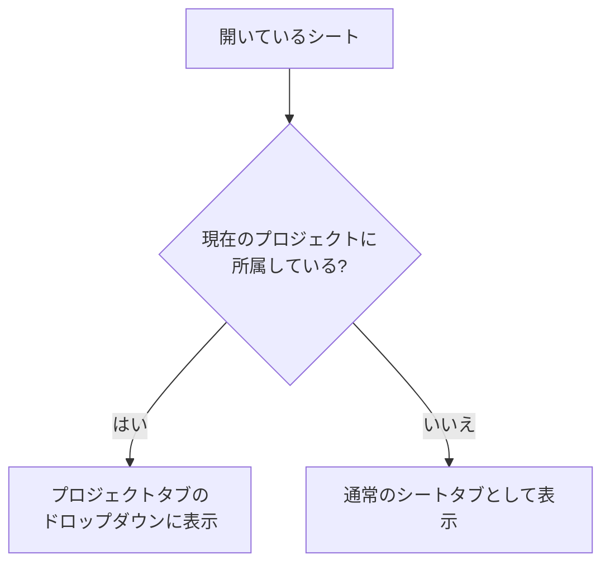

# タブエリア再設計（ターミナル／プロジェクトのドロップダウン化）仕様書

## 1. 目的

タブエリアに並ぶ要素を整理し、ターミナルとプロジェクトのシートを
それぞれ固定タブのドロップダウンへ収める。

現状はターミナルタブがシートタブの間に挿入され（アクティブなシートの左隣）、
プロジェクトのシートも通常のシートタブと混在しているため、
タブが増えると目的のものを探しにくい。

## 2. タブエリアの構成

```
┌─────────────┬──────────────┬────────────────────────────────┐
│ ターミナル ▾ │ プロジェクト ▾ │  sheet1   sheet2   sheet3  ...  │
└─────────────┴──────────────┴────────────────────────────────┘
   左端に固定      その右に固定        通常のシートタブ
   移動不可        移動不可           ドラッグで並べ替え可能
```

| 要素 | 内容 | 表示条件 |
|---|---|---|
| ターミナルタブ | 起動中のターミナル一覧 | デスクトップ版（Tauri）のみ |
| プロジェクトタブ | 開いているプロジェクトのシート一覧 | プロジェクトを開いている時のみ |
| シートタブ | 上記以外のシート | 常時 |

* 固定タブは `tab_order` の管理対象から外すため、**ドラッグで移動できない**
* 通常のシートタブの並べ替えは従来どおり

## 3. 同じシートの重複を作らない

シートの実体は `sheets` という 1 つのリストで管理する（従来どおり）。
**同じシートを 2 箇所に表示しない**ため、表示先だけを振り分ける。



この方式により次が成り立つ。

* 既にタブとして開いていたシートがプロジェクトに含まれていた場合、
  **閉じるのでも複製するのでもなく、タブバーからドロップダウンへ移る**
* 編集内容・Undo 履歴・カーソル位置・スクロール位置は維持される
* 保存の競合が発生しない（実体が 1 つのため）
* プロジェクトからシートを外せば、自動的に通常のシートタブへ戻る

### 3-1. プロジェクトのシートを開き直した場合

シート選択ダイアログ（Alt+M）で、既にプロジェクトに入っているシートを選んだ場合は
**新しいタブを作らず、プロジェクトタブ内のそのシートを選択状態にする**。

既存の「同じ `drive_id` のシートが開かれていれば、それをアクティブにする」処理が
そのまま働くため、追加の分岐は不要。

### 3-2. 所属判定

`Sheet.guid` は開かれた経路によって拡張子が残る場合（`abc.md`）と
残らない場合（`abc`）があるため、`guid` と `title` の双方から拡張子を除いた値も
候補に含めて突き合わせる（`tabs::sheet_project_keys`）。

## 4. ターミナルタブ

| 操作 | 挙動 |
|---|---|
| タブをクリック | ドロップダウンを開く |
| 一覧から選択 | そのターミナルを表示 |
| 各行の ✕ | そのターミナルを閉じる |
| 「新規ターミナル」 | 新しいターミナルを起動（Alt+T と同じ） |
| Alt+T | 従来どおり新規ターミナルを起動 |
| Ctrl+D 等でシェル終了 | 一覧から自動的に消える |

* 起動中のターミナルが 0 個でもタブは表示し、押すと新規ターミナルを起動する
* アクティブなターミナルがある時はタブを強調表示し、その名前を併記する
* 一覧の並びは起動順

既存の `terminal_tab_ids` が追加・削除ともに面倒を見ているため、
ドロップダウンはこのリストを表示するだけでよい。

新規ターミナルを「アクティブなシートの左隣に挿入する」現在の処理（2 箇所）は
不要になるため削除する。

## 5. プロジェクトタブ

| 操作 | 挙動 |
|---|---|
| タブをクリック | ドロップダウンを開く |
| 一覧から選択 | そのシートを表示（Alt+R と同じ結果） |
| Alt+R | 従来どおりカード一覧から選択 |
| Alt+P | 従来どおりプロジェクトの切り替え・管理 |

* タブにはプロジェクト名を表示する
* プロジェクトのシートが選択されている時はタブを強調表示する
* **プロジェクトの切り替えはドロップダウンでは行わない**（Alt+P のまま）
* 一覧の並びはプロジェクトへの登録順

## 6. プロジェクトを開いた時のタブの扱い

プロジェクトを切り替えた際、前のプロジェクトのシートがそのまま残ると
通常のシートタブとして溢れてしまうため、次のとおりとする。

| 対象 | 扱い |
|---|---|
| 前に開いていたプロジェクトのシート | 保存して閉じる |
| 手動で開いたシート（プロジェクト外） | **そのまま残す** |
| ターミナル | そのまま残す（従来どおり） |

従来は「ターミナル以外の全タブを保存して閉じる」だったが、
プロジェクトのシートがタブバーを占有しなくなったため、
手動で開いたタブまで閉じる必要がなくなる。

> ※ この点のみ従来仕様からの変更となるため、レビューで確認いただきたい。

## 7. モジュール構成

| ファイル | 役割 |
|---|---|
| `src/tabs.rs`（新規） | タブの振り分け（**副作用なし・単体テスト対象**） |
| `src/components/tab_bar.rs` | 固定タブとドロップダウンの描画 |
| `src/app.rs` | 振り分け結果の受け渡し、ターミナル挿入処理の削除 |
| `src/i18n.rs` | 追加メッセージの国際化（9 言語） |

## 8. テスト

`src/tabs.rs` に `#[cfg(test)]` の単体テストを追加する。

| # | 対象 | 内容 | 期待 |
|---|---|---|---|
| 1 | `is_terminal_tab` | ID 接頭辞の判定 | `__TERM__` で始まる時のみ true |
| 2 | `guid_from_drive_name` | 拡張子の除去 | `abc.md`→`abc`、拡張子なしはそのまま |
| 3 | `sheet_project_keys` | guid の表記ゆれ | 拡張子あり・なしの双方が候補に入る |
| 4 | `partition_tabs` | プロジェクト未使用 | 全て通常タブ |
| 5 | `partition_tabs` | 所属シートあり | ドロップダウンとタブバーに重複しない |
| 6 | `partition_tabs` | 拡張子付き guid で開かれたシート | 正しくドロップダウンへ移る |
| 7 | `partition_tabs` | ターミナル混在 | 3 つのグループに分かれる |
| 8 | `partition_tabs` | 並び | 各グループで入力順を保つ |
| 9 | `partition_tabs` | guid の無い新規シート | 通常タブのまま |

### 手動確認

| # | 確認内容 | 期待 |
|---|---|---|
| 1 | ターミナルタブの位置 | 常に左端。ドラッグで動かせない |
| 2 | Alt+T / ドロップダウンから新規作成 | 一覧に増える |
| 3 | Ctrl+D でシェル終了 | 一覧から消える |
| 4 | プロジェクトを開く | シートがプロジェクトタブのドロップダウンに入る |
| 5 | 既に開いているシートを含むプロジェクトを開く | タブが二重にならず、ドロップダウンへ移る |
| 6 | Alt+M でプロジェクト内のシートを選択 | 新しいタブを作らず、そのシートが選択される |
| 7 | プロジェクトからシートを外す | 通常のシートタブへ戻る |
| 8 | ドロップダウンから選択 | そのシートが表示される（Alt+R と同じ） |
| 9 | Web 版 | ターミナルタブが表示されない |
| 10 | プロジェクト未使用時 | プロジェクトタブが表示されない |

## 9. 影響範囲

* 保存データ（IndexedDB / Drive / `.leaf_projects.json`）の構造は変更しない
* シートの実体管理（`sheets`）も変更しない。表示の振り分けのみ
* モバイルレイアウトはタブバー自体が非表示のため影響なし
