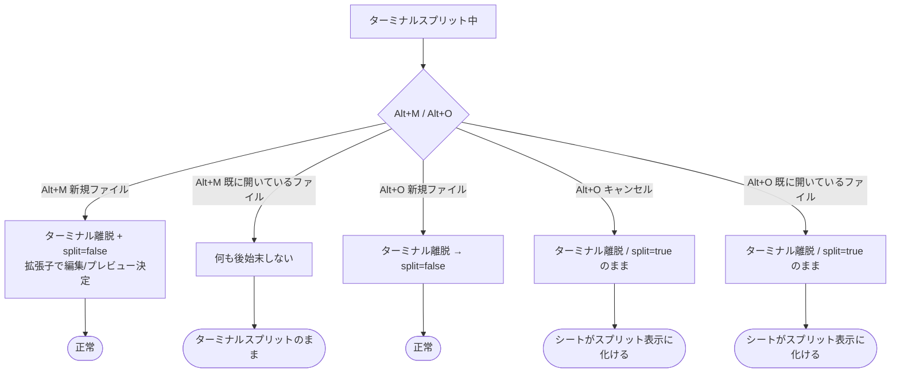

# ターミナルスプリット中の Alt+M / Alt+O でシートの表示モードが維持されない不具合

## 1. 現象

ターミナルをスプリットモードで使用している時に `Alt+M`（Drive ファイルを開く）または
`Alt+O`（ローカルファイルを開く）を押すと、アクティブになったシートが本来「編集モード」
または「プレビューモード」であったにもかかわらず、強制的にスプリット表示になる。

## 2. 前提となる内部構造

`terminal_split_enabled` は「ターミナル用」と「シート用」で共有された 1 つのフラグである。

| `terminal_split_enabled` | `active_terminal_id` | 画面 |
|---|---|---|
| true | Some | ターミナル左＋シート右（terminal split） |
| true | None | エディタ左＋プレビュー右（sheet split） |
| false | None | シート全画面（`is_preview_visible` で編集／プレビュー切替） |

```rust
// src/app.rs:4841
let is_split_view      = *terminal_split_enabled && (*active_terminal_id).is_none() && (*active_sheet_id).is_some();
let is_terminal_split  = *terminal_split_enabled && (*active_terminal_id).is_some() && (*active_sheet_id).is_some();
```

つまり **ターミナルを抜ける（`active_terminal_id` を None にする）時に
`terminal_split_enabled` を落とさないと、そのままシートのスプリット表示に化ける**。

正しい復帰処理はタブ選択（`on_tab_select_cb`, src/app.rs:4330 付近）に実装済みで、
シートごとに保存された表示状態を復元している。

```rust
// タブ毎の表示モードを復元（フェードなし）
ip.set(sheet.is_preview);
*ssf.borrow_mut() = true;
ts.set(sheet.is_split);
*ts_ref.borrow_mut() = sheet.is_split;
```

## 3. 原因

### 3-1. `Alt+O`（`on_import_cb`, src/app.rs:2263〜）

コールバック先頭でターミナルコンテキストを抜けるが、`terminal_split_enabled` を落としていない。

```rust
atid_imp.set(None);          // ターミナルを抜ける
*atref_imp.borrow_mut() = None;
*tse_ref_imp.borrow_mut() = false;
tse_imp.set(false);
spid_imp.set(None);
// ← terminal_split_enabled はここで true のまま
```

`terminal_split_enabled` を false にしているのは、**新規ファイルを読み込めた場合のみ**
（src/app.rs:2340 付近）。そのため以下の 2 経路で split が残る。

* **ネイティブのファイルダイアログをキャンセルした場合**（src/app.rs:2298 `res.is_null()` で return）
* **同名のローカルシートが既に開かれていた場合**（src/app.rs:2305〜のアーリーリターン）

また、キャンセル／既存シート経路では `is_preview_visible` の復元も行っていない。

### 3-2. `Alt+M`（`on_file_sel_cb`, src/app.rs:2075〜）

「既に同じ `drive_id` のシートが開かれている場合」のアーリーリターンで、
ターミナルコンテキストを抜ける処理そのものが無い。

```rust
if let Some(existing) = cur_s.iter().find(|s| s.drive_id.as_ref() == Some(&did)) {
    iv.set(false);
    activate_sheet_session(...);
    aid.set(Some(existing_id.clone()));
    if !is_same_as_active { apply_preview_visibility(&ip_sel, &pop_sel, existing.is_preview); }
    focus_editor();
    return;   // ← atid / terminal_split_enabled / tse / spid が未処理
}
```

結果、`active_terminal_id` も `terminal_split_enabled` も残るため、
シートを選んだのに画面はターミナルスプリットのまま（右ペインは
`split_pane_sheet_id` の別シート）となる。

さらに `is_same_as_active`（＝選んだファイルが現在のアクティブシート）の場合は
表示モードの再適用をスキップするため、ターミナルから戻った時にモードが復元されない。

### 3-3. 経路まとめ



## 4. 修正方針

ターミナルから抜ける全経路で、`on_tab_select_cb` と同じ「シートの保存済み表示状態を復元する」
処理を必ず通す。共通ヘルパーを 1 本用意して 3 箇所から呼ぶ。

### 4-1. 共通ヘルパー（新規）

```rust
/// ターミナルコンテキストを抜けて、対象シートの保存済み表示モード
/// （編集／プレビュー／スプリット）を復元する。
/// ターミナルがアクティブでない場合は何もしない。
fn leave_terminal_for_sheet(
    handles: &TerminalExitHandles,   // atid/atref/ts/ts_ref/tse/tse_ref/spid/spid_ref/ts_map/skip_fade
    sheets_ref: &Rc<RefCell<Vec<Sheet>>>,
    target_sheet_id: Option<&str>,   // 復元対象。None なら現在の active_sheet_id
    is_preview_visible: &UseStateHandle<bool>,
    preview_overlay_opacity: &UseStateHandle<bool>,
)
```

処理内容:

1. `active_terminal_id` が None なら即 return（非ターミナル時の副作用を避ける）
2. 現在のターミナルのスプリット状態を `terminal_split_map` へ保存
3. `active_terminal_id` / `terminal_split_edit_mode` / `split_pane_sheet_id` をクリア
4. 対象シートを `sheets_ref` から検索し
   * `skip_split_fade = true`（フェードなしで切替）
   * `terminal_split_enabled = sheet.is_split`
   * `apply_preview_visibility(sheet.is_preview)`
   * シートが見つからない場合は `false` / `false` にフォールバック

### 4-2. 呼び出し箇所

| 箇所 | 変更 |
|---|---|
| `on_import_cb` 先頭（src/app.rs:2263） | 既存のターミナル離脱処理をヘルパー呼び出しに置換（対象＝現在のアクティブシート） |
| `on_import_cb` 既存ローカルシート経路（src/app.rs:2305） | 対象シートの `is_preview` / `is_split` を復元（ヘルパーは既に離脱済みなので、表示モード復元のみ再適用） |
| `on_file_sel_cb` 既存シート経路（src/app.rs:2075） | アーリーリターン前にヘルパーを呼び、`existing.is_preview` / `existing.is_split` を復元。<br/>`is_same_as_active` でも「ターミナルから戻った場合」は表示モードを再適用する |

### 4-2-1. 非ターミナル時の同一不具合もあわせて修正する

`terminal_split_enabled` はシートスプリット（エディタ左＋プレビュー右）とも共有のため、
**ターミナルを使っていなくても同じ現象が起きる**。

* シートスプリット表示中に `Alt+M` で「既に開いている別シート」を選ぶと、
  `is_preview` は反映されるが `is_split` は反映されず、スプリット表示のまま残る。

原因・修正とも同一のため、`on_file_sel_cb` の既存シート経路では
`apply_preview_visibility()` を `restore_sheet_view_mode()` に置き換え、
タブ選択（`on_tab_select_cb`）と完全に同じ復元処理へ統一する。

### 4-3. `Alt+O` キャンセル時

ヘルパーで `terminal_split_enabled = sheet.is_split` に復元されるため、
キャンセルしても直前のシートの本来の表示モードに戻る。

> 補足: 「キャンセルならターミナルに戻すべきでは」という選択肢もあるが、
> 現行実装は `Alt+O` を押した時点でターミナルを抜ける仕様なので、
> 本修正では挙動を変えず「シートの本来の表示モードで表示する」に統一する。

## 5. テスト観点（Tauri デスクトップ版のみ／ターミナルは Tauri 限定機能）

| # | 前提 | 操作 | 期待 |
|---|---|---|---|
| 1 | ターミナルスプリット中、直前シート A は編集モード | Alt+O → キャンセル | シート A が **編集モード全画面** |
| 2 | 同上、直前シート A はプレビューモード | Alt+O → キャンセル | シート A が **プレビュー全画面** |
| 3 | ターミナルスプリット中 | Alt+O → 既に開いているローカルファイルを選択 | そのシートの保存済みモードで全画面表示 |
| 4 | ターミナルスプリット中 | Alt+O → 新規ローカルファイルを選択 | 拡張子既定モード（.md はプレビュー）で全画面表示 |
| 5 | ターミナルスプリット中 | Alt+M → 既に開いている Drive ファイルを選択 | そのシートがアクティブになり、保存済みモードで全画面表示（ターミナル離脱） |
| 6 | ターミナルスプリット中 | Alt+M → 未読み込みの Drive ファイルを選択 | 拡張子既定モードで全画面表示 |
| 7 | ターミナルスプリット中、シート A は `is_split=true` | Alt+M → シート A を選択 | シート A がスプリット表示（エディタ＋プレビュー）で復元される |
| 8 | ターミナル非アクティブ（通常のシート表示） | Alt+M / Alt+O | 従来どおり（回帰なし） |
| 9 | シートスプリット表示中（ターミナル無し） | Alt+M → 既に開いている別シート（`is_split=false`）を選択 | スプリットが解除され、そのシートの保存済みモードで全画面表示 |

## 6. 影響範囲

* `src/app.rs` のみ（`on_import_cb` / `on_file_sel_cb` ＋ 共通ヘルパー追加）
* 表示ロジック・保存データ構造の変更なし
* Web 版はターミナル機能が無いため実質影響なし（ヘルパーは `active_terminal_id` が None で即 return）
