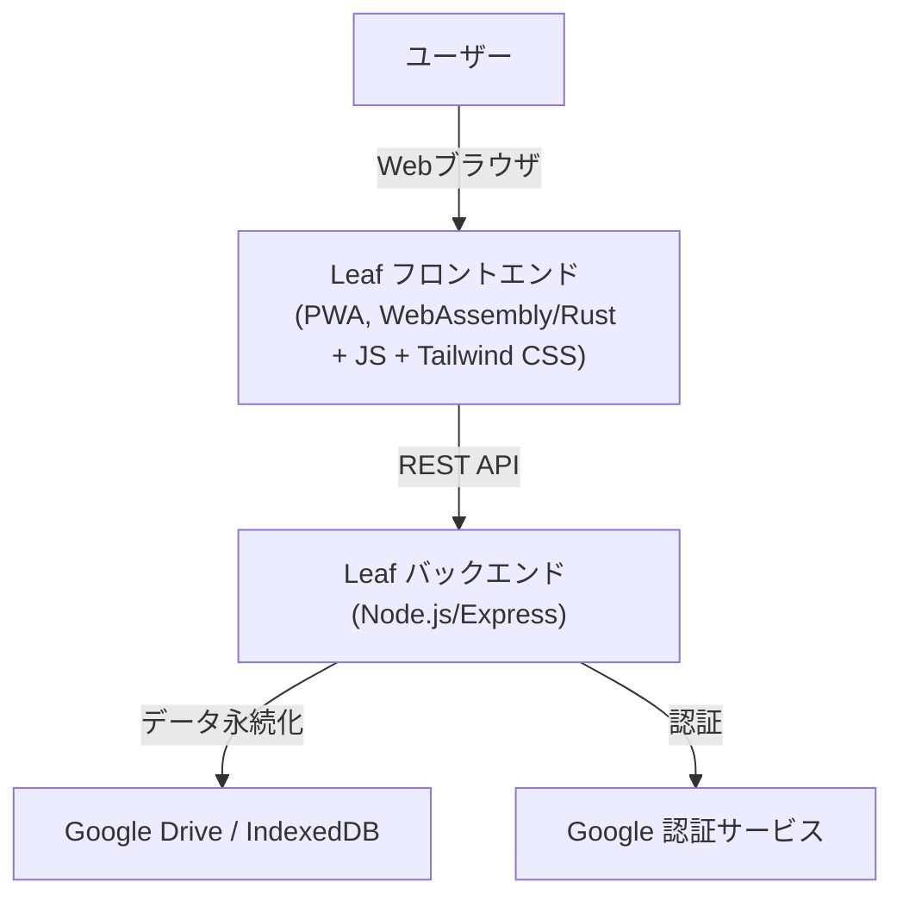
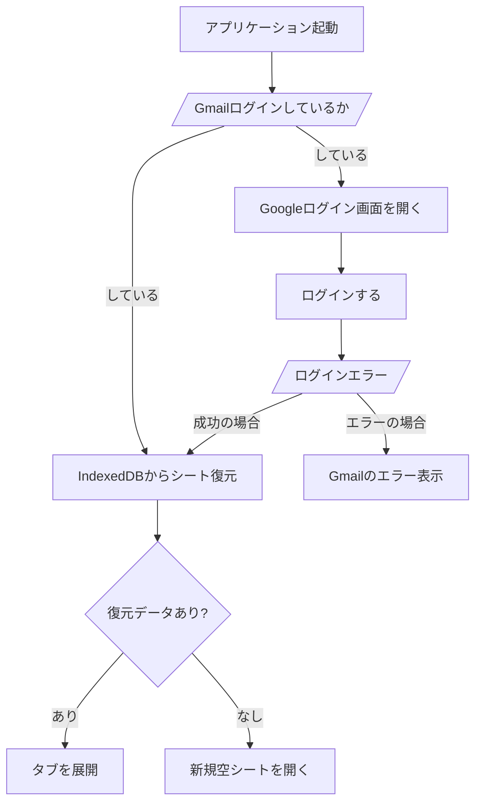
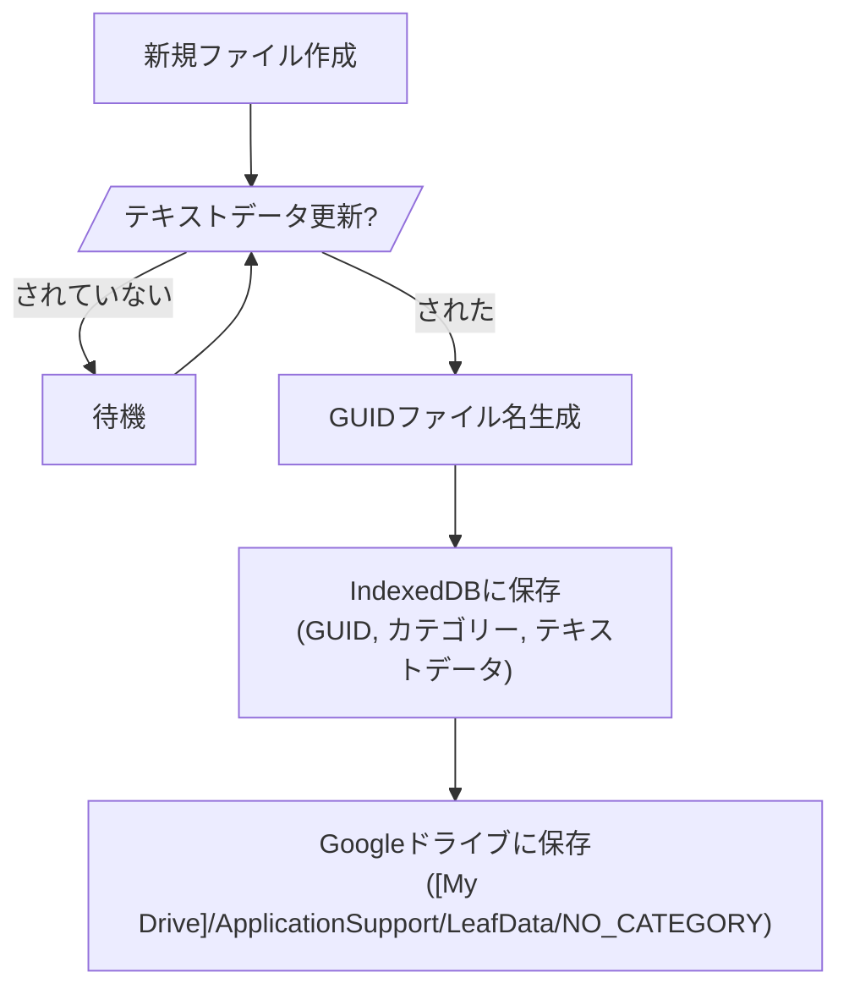

# テキストエディター「Leaf」仕様書

## 1. 概要
本ドキュメントは、テキストエディター「Leaf」のシステム仕様を定義する。
「Leaf」は、PWAとして実装され、WebAssembly (Rust) をコアとし、モダンなWeb技術とクラウド連携を特徴とする高機能テキストエディターである。

## 2. システムアーキテクチャ

### 2.1 全体構成
Leafは、PWA (Progressive Web Application) として実装され、WebAssemblyをベースとしたフロントエンドと、Node.js+Expressで構築されたバックエンドAPIから構成される。
バックエンドを使用せずにフロントエンドだけで完結できる場合は、フロントエンドのみで実装を完結させる。
フロントエンドはUI表示とユーザー入力の収集に特化し、全てのビジネスロジックはバックエンドで処理される（バックエンドが存在する場合）。
UIのスタイリングにはTailwind CSSを使用する。

### 2.2 フロントエンド技術スタック
*   **アプリケーション形式**: PWA (Progressive Web Application)
*   **コアロジック**: WebAssembly (Rust)
*   **DOM操作・ブラウザ機能連携**: JavaScriptライブラリ呼び出し
*   **UIスタイリング**: Tailwind CSS
*   **テキスト編集**: Ace Editor (Vimモード切り替え機能付き)

### 2.3 バックエンド技術スタック
*   **APIフレームワーク**: Node.js + Express
*   **ビジネスロジック**: 全てのビジネスロジックはバックエンドに記述される。バックエンドなしで実装可能な場合は、フロントエンドのみで完結する。
*   **外部連携**: 外部からのデータ収集およびフロントエンドとのREST API通信を担当。

## 3. 機能要件

### 3.1 テキスト編集機能
*   **編集モード**: 「vim」モードのオン/オフをサポート（デフォルトはオン）。
*   **エディタライブラリ**: Ace Editorを使用。
*   **タブインターフェース**: 複数の編集タブをサポートし、各タブは「シート」と呼称する。

### 3.2 データ永続化
*   **設定データ**: `localStorage` に以下の設定を保存する。
    *   VimモードのON/OFF状態。
*   **データファイル (IndexedDB)**: 
    *   現在開かれているシートの状態をオブジェクトとして保持する。
    *   アプリ起動時、IndexedDBのデータを元にタブの状態を復元する。
    *   シートオブジェクトの構成:
        *   GUID (ファイル名)
        *   カテゴリー (デフォルト: `NO_CATEGORY`)
        *   ファイルパス (`[My Drive]/ApplicationSupport/LeafData/[カテゴリー]/[GUID]`)
        *   テキストコンテンツ
    *   `IndexedDB` のスキーマ変更時には、バージョン番号を上げて対応する。

### 3.3 ファイル管理と自動保存
*   **新規ファイル作成**: 起動時に既存データがない場合、またはユーザー操作により作成される。
*   **Google ドライブ保存のトリガー**: 
    *   新規シートのテキストが変更された際、ユニークな GUID を生成し、Google ドライブへ保存を開始する。
    *   保存先: `[My Drive]/ApplicationSupport/LeafData/[カテゴリー]/[GUID]`
*   **自動保存**: 
    *   Google ドライブに保存済みのシートは、最終編集から 5 秒間操作がない場合に自動的に上書き保存される。
*   **文字コード**: 
    *   保存形式は BOM 付き UTF-8 プレインテキストとする。
    *   読み込み時に BOM 付き UTF-8 ではない場合、変換の確認ダイアログを表示する。

### 3.4 認証とGoogle Drive連携
*   **ログイン**: Gmailアカウントでのログインが必須。
*   **権限**: メールアドレスの取得、および Google ドライブへの Read/Write 権限。
*   **専用ディレクトリの自動作成**:
    *   初回ログイン時、以下のディレクトリが存在しない場合は作成する。
        *   `[My Drive]/ApplicationSupport/LeafData`
        *   `[My Drive]/ApplicationSupport/LeafData/NO_CATEGORY`

### 3.5 アプリケーション起動時の挙動
1.  Gmail 認証状態の確認。
2.  IndexedDB から前回開いていたシート情報を取得し、タブを復元。
3.  既存データがない場合は、空の新規シートを開く。

### 3.6 キーボードショートカット
Vimモードが ON の場合、OS標準のショートカット（Mac: Cmd, Win: Win）を奪取する。

*   **Cmd/Win + t**: 新規シートを開く。
*   **Cmd/Win + w**: 
    *   現在のシートを閉じる。
    *   未保存（Google ドライブ未同期）の場合は警告ダイアログを表示。
*   **Cmd/Win + s**: 
    *   保存済みシートは即座に保存。
    *   未保存シートは保存ダイアログを表示。
*   **Cmd/Win + f**: テキスト検索。
*   **Cmd/Win + Shift + f**: テキスト正規表現検索。
*   **Ctrlキー**: Vimモード ON 時は Vim に準拠、OFF 時は標準動作。

## 4. ユーザーインターフェース (UI)

### 4.1 レイアウト
*   **ボタンバー (最上段)**: 
    *   「新規シート作成」アイコン
    *   「保存」アイコン (フロッピー)
    *   「Vimモード ON/OFF」切り替え
*   **タブ表示エリア (ボタンバーの下)**: 
    *   開いているシートをタブ形式で表示。
    *   タブ外のエリアをダブルクリックすることで新規シートを作成。
*   **エディタエリア (中央)**: Ace Editorを表示。
*   **ステータスバー (最下段)**: 
    *   ネットワーク接続状況を表示（右端）。
    *   接続中: 緑色「Network connected」
    *   未接続: 赤色「Network unreachable」

## 5. アプリケーションフロー

### 5.1 アプリケーション起動フロー

### 5.2 新規ファイル生成フロー

