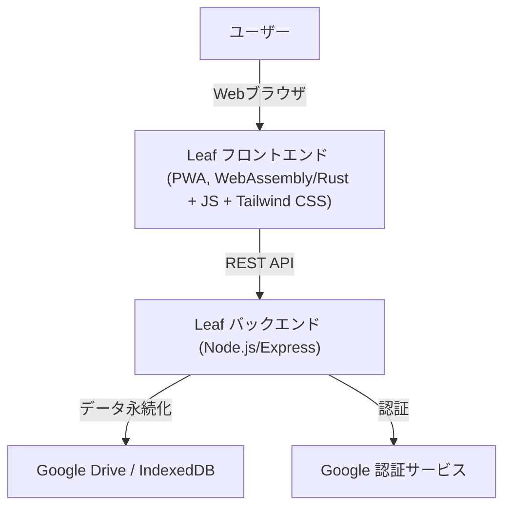
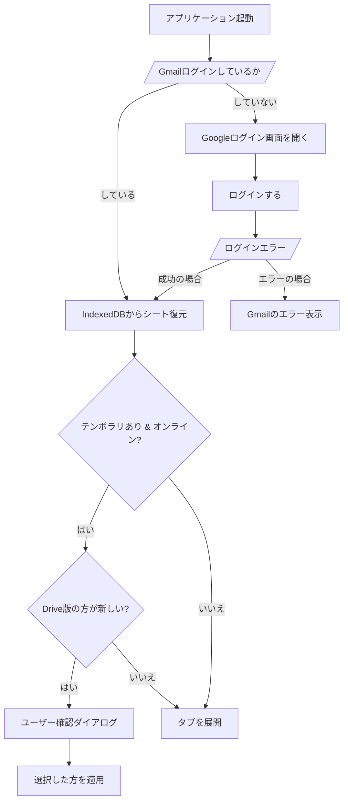

# テキストエディター「Leaf」仕様書

## 1. 概要
本ドキュメントは、テキストエディター「Leaf」のシステム仕様を定義する。
「Leaf」は、PWAとして実装され、WebAssembly (Rust) をコアとし、モダンなWeb技術とクラウド連携を特徴とする高機能テキストエディターである。

## 2. システムアーキテクチャ

### 2.1 全体構成
Leafは、PWA (Progressive Web Application) として実装され、WebAssemblyをベースとしたフロントエンドと、Node.js+Expressで構築されたバックエンドAPIから構成される。
バックエンドを使用せずにフロントエンドだけで完結できる場合は、フロントエンドのみで実装を完結させる。
フロントエンドはUI表示とユーザー入力の収集に特化し、全てのビジネスロジックはバックエンドで処理される（バックエンドが存在する場合）。
UIのスタイリングにはTailwind CSSを使用する。

### 2.2 フロントエンド技術スタック
*   **アプリケーション形式**: PWA (Progressive Web Application)
*   **コアロジック**: WebAssembly (Rust)
*   **DOM操作・ブラウザ機能連携**: JavaScriptライブラリ呼び出し
*   **UIスタイリング**: Tailwind CSS
*   **テキスト編集**: Ace Editor (Vimモード切り替え機能付き)

### 2.3 バックエンド技術スタック
*   **APIフレームワーク**: Node.js + Express
*   **ビジネスロジック**: 全てのビジネスロジックはバックエンドに記述される。バックエンドなしで実装可能な場合は、フロントエンドのみで完結する。
*   **外部連携**: 外部からのデータ収集およびフロントエンドとのREST API通信を担当。

## 3. 機能要件

### 3.1 テキスト編集機能
*   **編集モード**: 「vim」モードのオン/オフをサポート（デフォルトはオン）。
*   **エディタライブラリ**: Ace Editorを使用。
*   **単一シート編集**: 同時に編集できるファイル（シート）は1つのみとする。タブインターフェースは持たない。

### 3.2 データ永続化
*   **設定データ**: `localStorage` に以下の設定を保存する。
    *   VimモードのON/OFF状態。
*   **データファイル (IndexedDB)**: 
    *   現在開かれているシートの状態を常に保持する。
    *   オンライン・オフラインに関わらず最新の編集内容は IndexedDB にミラーリングされる。
    *   オフライン編集時は `temp_content` と保存時刻を記録し、同期が必要なことを示す。
    *   シートオブジェクトの構成:
        *   id (内部管理ID)
        *   guid (ファイル名)
        *   category (デフォルト: `NO_CATEGORY`)
        *   title (シートタイトル)
        *   content (最新の編集内容)
        *   drive_id (Google ドライブのファイルID)
        *   temp_content (未同期のテンポラリ内容)
        *   temp_timestamp (未同期保存時のタイムスタンプ)
    *   `IndexedDB` のスキーマ変更時には、バージョン番号を上げて対応する。

### 3.3 ファイル管理と自動保存
*   **新規ファイル作成**: 起動時に既存データがない場合、またはユーザー操作により作成される。既存のシートは閉じられ、新しいシートに置き換わる。
*   **Google ドライブ保存のトリガー**: 
    *   新規シートのテキストが変更された際、ユニークな GUID を生成し、Google ドライブへ保存を開始する。
    *   保存先: `[My Drive]/ApplicationSupport/LeafData/[カテゴリー]/[GUID]`
*   **自動保存**: 
    *   最終編集から 3 秒間操作がない場合に非同期で実行される。
    *   オンライン時: Google ドライブと IndexedDB の両方を更新。成功時にテンポラリ情報をクリア。
    *   オフライン時: IndexedDB の `content` とテンポラリ情報（`temp_content`, `temp_timestamp`）を更新。
*   **ネットワーク復帰時の同期**:
    *   オフラインからオンラインに復帰した際、テンポラリデータがあるシートを自動的に Google ドライブへアップロードする。
*   **競合解決ロジック (アプリ起動時)**:
    *   IndexedDB にテンポラリデータがあり、かつオンラインの場合、Google ドライブ上の最終更新時刻と比較する。
    *   Google ドライブ版の方が新しい場合、どちらを残すかユーザーに確認するダイアログを表示する。

### 3.4 認証とGoogle Drive連携
*   **ログイン**: Gmailアカウントでのログインが必須。
*   **権限**: メールアドレスの取得、および Google ドライブへの Read/Write 権限。
*   **専用ディレクトリの自動作成**:
    *   初回ログイン時、以下のディレクトリが存在しない場合は作成する。
        *   `[My Drive]/ApplicationSupport/LeafData`
        *   `[My Drive]/ApplicationSupport/LeafData/NO_CATEGORY`

### 3.5 アプリケーション起動時の挙動
1.  Gmail 認証状態の確認。
2.  IndexedDB から開いていたシート情報を取得し、復元。
3.  オンラインであれば Google ドライブ版との新旧比較を実施。
4.  既存データがない場合は、空の新規シートを開く。

### 3.6 キーボードショートカット
Vimモードが ON の場合、OS標準のショートカット（Mac: Cmd, Win: Win）を奪取せず、Leaf独自のショートカットとして「Opt/Alt」キーを使用する。

*   **Opt/Alt + t**: 新規シートを開く（現在のシートは自動保存された後、閉じられる）。
*   **Opt/Alt + s**: 現在のシートを保存する。新規シート（未保存）の場合は GUID を生成し Google ドライブの `NO_CATEGORY` フォルダへ保存する。初回保存完了後、以降の変更に対して自動保存が有効になる。
*   **Opt/Alt + o**: ファイル選択ダイアログを開く。
*   **Opt/Alt + f**: テキスト検索。
*   **Ctrlキー**: Vimモード ON 時は Vim に準拠、OFF 時は標準動作。

### 3.7 ファイル選択ダイアログ
*   **起動**: ボタンバーのアイコンまたは `Opt/Alt + o` ショートカット。
*   **サイズ**: ブラウザ画面の縦横 80%。
*   **階層構造**:
    1.  **カテゴリー選択**: `[My Drive]/ApplicationSupport/LeafData` 配下のディレクトリ一覧を縦に表示。
    2.  **ファイル選択**: カテゴリー選択後、そのディレクトリ内のファイル一覧を表示。
*   **ファイル表示**: ファイル名を表示して選択するのではなく、ダイアログの縦サイズを 5 等分して配置したボタンに、ファイル内容のプレビューを表示して選択する。
*   **操作**:
    *   上下キーで選択移動。
    *   エンターキーで決定。
    *   選択されたファイルを読み込み、現在のシートを置き換える。

## 4. ユーザーインターフェース (UI)

### 4.1 レイアウト
*   **ボタンバー (最上段)**: 
    *   「新規シート作成」アイコン
    *   「ファイルを開く」アイコン
    *   「Vimモード ON/OFF」切り替え
*   **エディタエリア (中央)**: Ace Editorを表示。
*   **ステータスバー (最下段)**: 
    *   ネットワーク接続状況を表示（右端）。
    *   接続中: 緑色「Network connected」
    *   未接続: 赤色「Network unreachable」

### 4.3 起動時オーバーレイ
*   **外観**: `opacity: 0.8` の黒色オーバーレイ。
*   **コンテンツ**: 画面中央にローディングインジケータ（アニメーション付き）を表示。
*   **表示時間**:
    *   シートデータの競合チェックや初期化処理が終了しても、最低 1 秒間は表示を維持する。
    *   全ての非同期処理が終了し、テキスト編集が可能な状態になった時点でフェードアウトを開始する。
*   **演出**: 0.3 秒かけてフェードアウトする。

## 5. アプリケーションフロー

### 5.1 アプリケーション起動フロー

